# Advanced Research Ecosystem Design

## Overview

The Advanced Research Ecosystem extends the existing Advanced RAG system with 10 sophisticated services that address the complete research lifecycle. This design integrates seamlessly with existing services while adding transformative capabilities for research memory, planning, quality assurance, multilingual support, impact optimization, ethics compliance, funding assistance, reproducibility, trend prediction, and collaboration matchmaking.

## Architecture

### System Architecture Overview

```mermaid
graph TB
    subgraph "Advanced Research Ecosystem"
        RME[Research Memory Engine]
        IRP[Intelligent Research Planner]
        RQA[Research QA Engine]
        MRS[Multilingual Research Service]
        RIS[Research Impact Service]
        RES[Research Ethics Service]
        FAS[Funding Assistant Service]
        RRS[Research Reproducibility Service]
        RTS[Research Trend Service]
        CMS[Collaboration Matchmaking Service]
    end
    
    subgraph "Existing RAG Services"
        RA[Research Assistant]
        MP[Multimodal Processor]
        AA[Advanced Analytics]
        PE[Personalization Engine]
        RI[Realtime Intelligence]
    end
    
    subgraph "Data Layer"
        DB[(PostgreSQL)]
        VDB[(Vector DB)]
        CACHE[(Redis)]
        FILES[(File Storage)]
    end
    
    RME --> DB
    IRP --> DB
    RQA --> RA
    MRS --> MP
    RIS --> AA
    RES --> DB
    FAS --> DB
    RRS --> FILES
    RTS --> AA
    CMS --> PE
    
    RME --> CACHE
    IRP --> CACHE
    RIS --> VDB
    RTS --> VDB
    CMS --> VDB
```



### Integration Strategy

The new services integrate with existing components through:
- **Shared Database Schema**: Extended with new tables for research contexts, plans, ethics records, etc.
- **Service Orchestration**: New services call existing services for core functionality
- **Event-Driven Updates**: Real-time updates through the existing real-time intelligence system
- **Unified API Layer**: Consistent endpoint patterns following existing conventions

## Components and Interfaces

### 1. Research Memory Engine

**Purpose**: Maintains persistent research context across sessions and projects.

**Core Components**:
- **Context Manager**: Saves/restores research sessions
- **Project Tracker**: Manages multiple research projects
- **Timeline Builder**: Reconstructs research history
- **Context Switcher**: Facilitates project switching

**Key Interfaces**:
```python
class ResearchMemoryEngine:
    async def save_research_context(user_id: str, context: ResearchContext) -> bool
    async def restore_research_context(user_id: str, project_id: str) -> ResearchContext
    async def list_research_projects(user_id: str) -> List[ResearchProject]
    async def switch_project_context(user_id: str, from_project: str, to_project: str) -> bool
    async def generate_research_timeline(user_id: str, project_id: str) -> ResearchTimeline
```

### 2. Intelligent Research Planner

**Purpose**: AI-powered research planning with roadmaps, milestones, and adaptive timelines.

**Core Components**:
- **Roadmap Generator**: Creates comprehensive research plans
- **Milestone Tracker**: Monitors progress against goals
- **Timeline Optimizer**: Adjusts schedules based on progress
- **Risk Assessor**: Identifies and mitigates project risks

**Key Interfaces**:
```python
class IntelligentResearchPlanner:
    async def generate_research_roadmap(research_goals: ResearchGoals) -> ResearchRoadmap
    async def update_progress(project_id: str, progress_update: ProgressUpdate) -> UpdatedRoadmap
    async def assess_project_risks(project_id: str) -> RiskAssessment
    async def optimize_timeline(project_id: str, constraints: TimelineConstraints) -> OptimizedTimeline
    async def suggest_milestone_adjustments(project_id: str) -> List[MilestoneAdjustment]
```

### 3. Research Quality Assurance Engine

**Purpose**: Automated validation of research methodology, analysis, and findings.

**Core Components**:
- **Methodology Validator**: Checks research methods against best practices
- **Statistical Analyzer**: Validates statistical approaches and calculations
- **Bias Detector**: Identifies potential biases in research design
- **Citation Checker**: Verifies citation accuracy and completeness

**Key Interfaces**:
```python
class ResearchQAEngine:
    async def validate_methodology(methodology: ResearchMethodology) -> ValidationReport
    async def check_statistical_analysis(analysis: StatisticalAnalysis) -> AnalysisReport
    async def assess_bias_risk(research_design: ResearchDesign) -> BiasAssessment
    async def verify_citations(citations: List[Citation]) -> CitationReport
    async def generate_reproducibility_checklist(research: ResearchProject) -> ReproducibilityChecklist
```

### 4. Multilingual Research Service

**Purpose**: Cross-language research support with context-aware translation and cultural adaptation.

**Core Components**:
- **Context-Aware Translator**: Preserves research context in translations
- **Cultural Adapter**: Adjusts for regional research practices
- **Multilingual Search**: Searches across language barriers
- **Collaboration Facilitator**: Enables international research collaboration

**Key Interfaces**:
```python
class MultilingualResearchService:
    async def translate_with_context(text: str, source_lang: str, target_lang: str, context: ResearchContext) -> Translation
    async def search_multilingual_literature(query: str, languages: List[str]) -> MultilingualResults
    async def adapt_methodology_for_culture(methodology: ResearchMethodology, culture: str) -> AdaptedMethodology
    async def facilitate_international_collaboration(participants: List[Researcher]) -> CollaborationPlan
```

### 5. Research Impact Service

**Purpose**: Predicts and optimizes research impact through strategic recommendations.

**Core Components**:
- **Impact Predictor**: Forecasts citation and influence potential
- **Journal Recommender**: Suggests optimal publication venues
- **Collaboration Optimizer**: Identifies impact-amplifying partnerships
- **Trend Aligner**: Aligns research with emerging trends

**Key Interfaces**:
```python
class ResearchImpactService:
    async def predict_citation_impact(research: ResearchProject) -> ImpactPrediction
    async def recommend_journals(research: ResearchProject) -> List[JournalRecommendation]
    async def identify_collaboration_opportunities(research: ResearchProject) -> List[CollaborationOpportunity]
    async def assess_trend_alignment(research: ResearchProject) -> TrendAlignment
    async def optimize_for_impact(research: ResearchProject) -> ImpactOptimizationPlan
```

### 6. Research Ethics Service

**Purpose**: Automated ethics compliance and regulatory requirement management.

**Core Components**:
- **Ethics Requirement Analyzer**: Identifies applicable ethics requirements
- **Protocol Generator**: Creates ethics protocols and consent forms
- **Compliance Monitor**: Tracks ongoing compliance throughout research
- **Regulatory Tracker**: Monitors changing regulations and requirements

**Key Interfaces**:
```python
class ResearchEthicsService:
    async def analyze_ethics_requirements(research: ResearchProject) -> EthicsRequirements
    async def generate_ethics_protocol(research: ResearchProject) -> EthicsProtocol
    async def monitor_compliance(project_id: str) -> ComplianceStatus
    async def track_regulatory_changes(research_domain: str) -> List[RegulatoryUpdate]
    async def generate_consent_forms(research: ResearchProject) -> List[ConsentForm]
```

### 7. Funding Assistant Service

**Purpose**: AI-powered funding discovery and grant application assistance.

**Core Components**:
- **Opportunity Matcher**: Finds relevant funding opportunities
- **Proposal Assistant**: Helps write compelling grant proposals
- **Budget Optimizer**: Optimizes grant budgets for success
- **Success Predictor**: Predicts application success probability

**Key Interfaces**:
```python
class FundingAssistantService:
    async def find_funding_opportunities(research: ResearchProject) -> List[FundingOpportunity]
    async def assist_proposal_writing(proposal_draft: ProposalDraft) -> ProposalAssistance
    async def optimize_budget(budget: ResearchBudget, constraints: BudgetConstraints) -> OptimizedBudget
    async def predict_success_probability(application: GrantApplication) -> SuccessPrediction
    async def track_application_deadlines(user_id: str) -> List[DeadlineAlert]
```

### 8. Research Reproducibility Service

**Purpose**: Ensures and facilitates research reproducibility through automated documentation and validation.

**Core Components**:
- **Methodology Documenter**: Automatically captures detailed methods
- **Environment Manager**: Manages code and data versioning
- **Reproducibility Validator**: Validates reproducibility of results
- **Replication Facilitator**: Packages research for replication studies

**Key Interfaces**:
```python
class ResearchReproducibilityService:
    async def document_methodology(research: ResearchProject) -> MethodologyDocumentation
    async def manage_research_environment(project_id: str) -> EnvironmentSnapshot
    async def validate_reproducibility(research: ResearchProject) -> ReproducibilityReport
    async def package_for_replication(research: ResearchProject) -> ReplicationPackage
    async def generate_reproducibility_score(research: ResearchProject) -> ReproducibilityScore
```

### 9. Research Trend Service

**Purpose**: Advanced trend prediction and early warning system for research opportunities.

**Core Components**:
- **Trend Analyzer**: Identifies emerging research trends
- **Convergence Detector**: Spots technology and field convergences
- **Opportunity Alerter**: Provides early warnings for research opportunities
- **Competitive Analyzer**: Analyzes competitive research landscapes

**Key Interfaces**:
```python
class ResearchTrendService:
    async def analyze_emerging_trends(research_domain: str) -> List[EmergingTrend]
    async def detect_field_convergences() -> List[FieldConvergence]
    async def generate_opportunity_alerts(user_profile: ResearcherProfile) -> List[OpportunityAlert]
    async def analyze_competitive_landscape(research_area: str) -> CompetitiveLandscape
    async def predict_breakthrough_opportunities(research_domain: str) -> List[BreakthroughOpportunity]
```

### 10. Collaboration Matchmaking Service

**Purpose**: Intelligent researcher matching and collaboration optimization.

**Core Components**:
- **Expertise Matcher**: Matches complementary research expertise
- **Success Predictor**: Predicts collaboration success probability
- **Team Optimizer**: Optimizes research team composition
- **Conflict Resolver**: Provides collaboration conflict resolution

**Key Interfaces**:
```python
class CollaborationMatchmakingService:
    async def find_collaboration_matches(researcher: ResearcherProfile) -> List[CollaborationMatch]
    async def predict_collaboration_success(team: ResearchTeam) -> SuccessPrediction
    async def optimize_team_composition(research_goals: ResearchGoals) -> OptimalTeam
    async def facilitate_cross_disciplinary_connections(research_area: str) -> List[CrossDisciplinaryMatch]
    async def resolve_collaboration_conflicts(conflict: CollaborationConflict) -> ConflictResolution
```

## Data Models

### Core Data Structures

```python
@dataclass
class ResearchContext:
    project_id: str
    user_id: str
    active_documents: List[str]
    current_queries: List[str]
    research_focus: str
    insights_generated: List[str]
    session_timestamp: datetime
    context_metadata: Dict[str, Any]

@dataclass
class ResearchRoadmap:
    project_id: str
    phases: List[ResearchPhase]
    milestones: List[Milestone]
    timeline: ProjectTimeline
    resource_requirements: ResourceRequirements
    risk_assessment: RiskAssessment
    success_metrics: List[SuccessMetric]

@dataclass
class ValidationReport:
    methodology_score: float
    issues_identified: List[ValidationIssue]
    recommendations: List[str]
    best_practice_alignment: float
    confidence_score: float

@dataclass
class ImpactPrediction:
    citation_potential: float
    influence_score: float
    novelty_assessment: float
    significance_rating: float
    timeline_to_impact: timedelta
    confidence_interval: Tuple[float, float]
```

## Error Handling

### Error Categories
1. **Service Integration Errors**: Failures in communication between new and existing services
2. **Data Validation Errors**: Invalid research data or context information
3. **External API Errors**: Failures in third-party integrations (funding databases, ethics systems)
4. **Resource Constraint Errors**: Insufficient computational resources for complex analyses
5. **User Permission Errors**: Unauthorized access to sensitive research information

### Error Recovery Strategies
- **Graceful Degradation**: Provide reduced functionality when full features are unavailable
- **Retry Mechanisms**: Automatic retry with exponential backoff for transient failures
- **Fallback Services**: Alternative approaches when primary methods fail
- **User Notification**: Clear communication about service limitations or failures
- **Data Consistency**: Ensure research context and data remain consistent during failures

## Testing Strategy

### Unit Testing
- **Service Logic Testing**: Comprehensive testing of each service's core functionality
- **Integration Testing**: Testing interactions between new and existing services
- **Data Model Testing**: Validation of all data structures and transformations
- **API Endpoint Testing**: Complete testing of all new API endpoints

### Integration Testing
- **Cross-Service Communication**: Testing communication between all services
- **Database Integration**: Testing database operations and transactions
- **Real-time Updates**: Testing real-time notifications and updates
- **User Workflow Testing**: End-to-end testing of complete research workflows

### Performance Testing
- **Load Testing**: Testing system performance under high user loads
- **Scalability Testing**: Testing system scaling capabilities
- **Memory Usage Testing**: Monitoring memory usage for large research contexts
- **Response Time Testing**: Ensuring acceptable response times for all operations

### Security Testing
- **Data Privacy Testing**: Ensuring research data privacy and security
- **Access Control Testing**: Testing user permissions and access controls
- **Ethics Compliance Testing**: Validating ethics and compliance features
- **Audit Trail Testing**: Testing comprehensive audit logging

## Security Considerations

### Data Protection
- **Research Data Encryption**: All research data encrypted at rest and in transit
- **Context Isolation**: Research contexts isolated between users and projects
- **Sensitive Information Handling**: Special handling for sensitive research data
- **Compliance Monitoring**: Continuous monitoring for regulatory compliance

### Access Control
- **Role-Based Access**: Different access levels for different user roles
- **Project-Based Permissions**: Access control at the research project level
- **Collaboration Security**: Secure sharing and collaboration features
- **Audit Logging**: Comprehensive logging of all access and modifications

### Privacy Protection
- **Anonymization**: Automatic anonymization of sensitive research data
- **Consent Management**: Proper handling of research participant consent
- **Data Retention**: Appropriate data retention and deletion policies
- **Cross-Border Compliance**: Compliance with international data protection laws