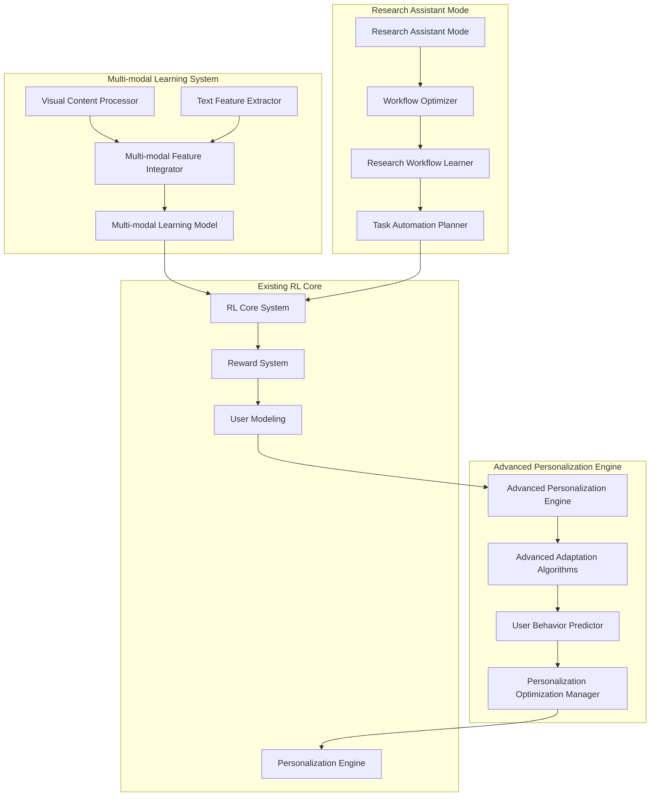

# Advanced Reinforcement Learning Features Design

## Overview

This design document outlines the architecture and implementation approach for integrating advanced reinforcement learning capabilities into AI Scholar, including multi-modal learning, sophisticated personalization algorithms, and specialized research assistant mode optimization. The design builds upon the existing RL framework while introducing new components for enhanced learning and adaptation.

## Architecture

### High-Level System Architecture



### Component Integration Strategy

The new advanced features integrate with the existing RL system through:

1. **Multi-modal Learning System** extends the current reward and feedback mechanisms
2. **Advanced Personalization Engine** enhances the existing personalization engine
3. **Research Assistant Mode** operates as a specialized mode within the current conversation system

## Components and Interfaces

### 1. Multi-modal Learning System

#### Visual Content Processor
```python
class VisualContentProcessor:
    """Processes and analyzes visual elements in research documents."""
    
    async def extract_visual_features(self, document: Document) -> VisualFeatures
    async def classify_visual_elements(self, visual_data: bytes) -> List[VisualElement]
    async def extract_quantitative_data(self, chart_image: bytes) -> QuantitativeData
    async def analyze_diagram_structure(self, diagram_image: bytes) -> StructuralRelationships
```

#### Multi-modal Feature Integrator
```python
class MultiModalFeatureIntegrator:
    """Integrates textual and visual features for unified learning."""
    
    async def integrate_features(
        self, 
        text_features: TextFeatures, 
        visual_features: VisualFeatures
    ) -> MultiModalFeatures
    
    async def create_cross_modal_embeddings(
        self, 
        features: MultiModalFeatures
    ) -> CrossModalEmbeddings
```

#### Multi-modal Learning Model
```python
class MultiModalLearningModel:
    """Core learning model that processes multi-modal inputs."""
    
    async def train_on_multimodal_data(
        self, 
        training_data: List[MultiModalTrainingExample]
    ) -> TrainingResults
    
    async def generate_multimodal_recommendations(
        self, 
        context: MultiModalContext
    ) -> List[Recommendation]
```

### 2. Advanced Personalization Engine

#### Advanced Adaptation Algorithms
```python
class AdvancedAdaptationAlgorithms:
    """Sophisticated algorithms for user adaptation."""
    
    async def deep_preference_learning(
        self, 
        user_interactions: List[UserInteraction]
    ) -> DeepPreferenceModel
    
    async def contextual_bandit_optimization(
        self, 
        context: UserContext, 
        available_actions: List[Action]
    ) -> OptimalAction
    
    async def meta_learning_adaptation(
        self, 
        user_profile: UserProfile, 
        similar_users: List[UserProfile]
    ) -> AdaptationStrategy
```

#### User Behavior Predictor
```python
class UserBehaviorPredictor:
    """Predicts user behavior patterns and preferences."""
    
    async def predict_next_action(
        self, 
        current_context: UserContext
    ) -> PredictedAction
    
    async def predict_satisfaction_trajectory(
        self, 
        interaction_sequence: List[Interaction]
    ) -> SatisfactionTrajectory
    
    async def identify_behavior_patterns(
        self, 
        user_history: UserHistory
    ) -> List[BehaviorPattern]
```

### 3. Research Assistant Mode

#### Workflow Optimizer
```python
class WorkflowOptimizer:
    """Optimizes research workflows based on learned patterns."""
    
    async def analyze_workflow_efficiency(
        self, 
        workflow_history: List[WorkflowSession]
    ) -> EfficiencyAnalysis
    
    async def suggest_workflow_improvements(
        self, 
        current_workflow: ResearchWorkflow
    ) -> List[WorkflowImprovement]
    
    async def optimize_task_sequence(
        self, 
        tasks: List[ResearchTask]
    ) -> OptimizedTaskSequence
```

#### Research Workflow Learner
```python
class ResearchWorkflowLearner:
    """Learns from successful research patterns."""
    
    async def learn_from_successful_workflows(
        self, 
        successful_sessions: List[WorkflowSession]
    ) -> WorkflowPatterns
    
    async def identify_bottlenecks(
        self, 
        workflow_data: WorkflowAnalysisData
    ) -> List[Bottleneck]
    
    async def extract_best_practices(
        self, 
        domain_workflows: List[DomainWorkflow]
    ) -> List[BestPractice]
```

## Data Models

### Multi-modal Data Models

```python
@dataclass
class VisualElement:
    element_type: VisualElementType  # CHART, DIAGRAM, EQUATION, FIGURE
    bounding_box: BoundingBox
    confidence: float
    extracted_data: Optional[Dict[str, Any]]
    relationships: List[ElementRelationship]

@dataclass
class MultiModalFeatures:
    text_features: TextFeatures
    visual_features: List[VisualFeatures]
    cross_modal_relationships: List[CrossModalRelationship]
    integrated_embedding: np.ndarray
    confidence_scores: Dict[str, float]

@dataclass
class MultiModalContext:
    document_content: DocumentContent
    visual_elements: List[VisualElement]
    user_interaction_history: List[UserInteraction]
    research_context: ResearchContext
```

### Advanced Personalization Models

```python
@dataclass
class DeepPreferenceModel:
    preference_embeddings: np.ndarray
    preference_weights: Dict[str, float]
    temporal_preferences: List[TemporalPreference]
    contextual_modifiers: Dict[str, float]
    confidence_intervals: Dict[str, Tuple[float, float]]

@dataclass
class AdaptationStrategy:
    strategy_type: AdaptationStrategyType
    parameters: Dict[str, Any]
    expected_improvement: float
    risk_assessment: RiskAssessment
    rollback_conditions: List[RollbackCondition]

@dataclass
class BehaviorPattern:
    pattern_id: str
    pattern_type: BehaviorPatternType
    frequency: float
    context_conditions: List[ContextCondition]
    predictive_features: List[str]
    success_indicators: List[SuccessIndicator]
```

### Research Assistant Models

```python
@dataclass
class ResearchWorkflow:
    workflow_id: str
    research_domain: str
    task_sequence: List[ResearchTask]
    estimated_duration: timedelta
    success_metrics: List[SuccessMetric]
    optimization_opportunities: List[OptimizationOpportunity]

@dataclass
class WorkflowOptimization:
    optimization_type: OptimizationType
    current_efficiency: float
    target_efficiency: float
    recommended_changes: List[WorkflowChange]
    implementation_priority: Priority
    expected_impact: ImpactAssessment

@dataclass
class ResearchInsight:
    insight_type: InsightType
    content: str
    confidence: float
    supporting_evidence: List[Evidence]
    actionable_recommendations: List[ActionableRecommendation]
```

## Error Handling

### Multi-modal Processing Errors

```python
class MultiModalProcessingError(Exception):
    """Base exception for multi-modal processing errors."""
    pass

class VisualProcessingError(MultiModalProcessingError):
    """Errors in visual content processing."""
    
    def __init__(self, message: str, error_type: str, recovery_suggestions: List[str]):
        super().__init__(message)
        self.error_type = error_type
        self.recovery_suggestions = recovery_suggestions

class FeatureIntegrationError(MultiModalProcessingError):
    """Errors in feature integration."""
    pass
```

### Personalization Errors

```python
class PersonalizationError(Exception):
    """Base exception for personalization errors."""
    pass

class AdaptationFailureError(PersonalizationError):
    """Errors in adaptation algorithm execution."""
    
    def __init__(self, message: str, fallback_strategy: str):
        super().__init__(message)
        self.fallback_strategy = fallback_strategy

class PreferenceModelError(PersonalizationError):
    """Errors in preference model operations."""
    pass
```

### Research Assistant Errors

```python
class ResearchAssistantError(Exception):
    """Base exception for research assistant errors."""
    pass

class WorkflowOptimizationError(ResearchAssistantError):
    """Errors in workflow optimization."""
    
    def __init__(self, message: str, current_workflow: ResearchWorkflow):
        super().__init__(message)
        self.current_workflow = current_workflow

class TaskSequencingError(ResearchAssistantError):
    """Errors in task sequencing optimization."""
    pass
```

## Testing Strategy

### Multi-modal Learning Tests

1. **Visual Processing Tests**
   - Test visual element detection accuracy
   - Validate quantitative data extraction from charts
   - Test diagram structure analysis
   - Performance tests for large documents

2. **Feature Integration Tests**
   - Test cross-modal relationship detection
   - Validate embedding quality
   - Test integration with existing text processing

3. **Learning Model Tests**
   - Test multi-modal training convergence
   - Validate recommendation quality
   - Test model performance on diverse content types

### Advanced Personalization Tests

1. **Adaptation Algorithm Tests**
   - Test deep preference learning accuracy
   - Validate contextual bandit performance
   - Test meta-learning effectiveness

2. **Behavior Prediction Tests**
   - Test prediction accuracy across user types
   - Validate pattern recognition
   - Test real-time prediction performance

3. **Integration Tests**
   - Test integration with existing personalization
   - Validate backward compatibility
   - Test performance impact

### Research Assistant Mode Tests

1. **Workflow Optimization Tests**
   - Test efficiency analysis accuracy
   - Validate optimization suggestions
   - Test task sequencing algorithms

2. **Learning Tests**
   - Test pattern extraction from workflows
   - Validate best practice identification
   - Test bottleneck detection

3. **End-to-End Tests**
   - Test complete research sessions
   - Validate user experience improvements
   - Test performance across research domains

## Performance Considerations

### Multi-modal Processing Performance

- **Visual Processing**: Implement GPU acceleration for image analysis
- **Feature Integration**: Use efficient embedding techniques and caching
- **Memory Management**: Implement streaming processing for large documents
- **Scalability**: Design for horizontal scaling of processing pipelines

### Personalization Performance

- **Real-time Adaptation**: Optimize algorithms for sub-second response times
- **Model Efficiency**: Use lightweight models for real-time inference
- **Caching Strategy**: Implement intelligent caching of user preferences
- **Batch Processing**: Optimize batch updates for preference models

### Research Assistant Performance

- **Workflow Analysis**: Implement efficient pattern matching algorithms
- **Optimization Speed**: Ensure optimization suggestions are generated quickly
- **Memory Usage**: Optimize storage of workflow patterns and histories
- **Concurrent Processing**: Support multiple simultaneous research sessions

## Security and Privacy

### Data Protection

- **Visual Content**: Implement secure processing and storage of visual data
- **User Behavior**: Ensure privacy-preserving behavior analysis
- **Research Data**: Protect sensitive research information
- **Model Security**: Secure model parameters and training data

### Privacy Compliance

- **Data Minimization**: Collect only necessary data for functionality
- **User Consent**: Implement granular consent for advanced features
- **Data Retention**: Implement appropriate data retention policies
- **Anonymization**: Ensure user data is properly anonymized

## Integration Points

### Existing RL System Integration

1. **Reward System Enhancement**
   - Extend reward calculation to include multi-modal feedback
   - Integrate visual content quality metrics
   - Add research workflow efficiency rewards

2. **User Modeling Extension**
   - Enhance user profiles with multi-modal preferences
   - Add research workflow patterns to user models
   - Integrate advanced personalization insights

3. **Feedback Collection Enhancement**
   - Add visual content interaction tracking
   - Implement research workflow feedback collection
   - Enhance implicit feedback detection

### External System Integration

1. **Document Processing Pipeline**
   - Integrate with existing document analysis systems
   - Enhance PDF processing for visual content extraction
   - Add support for various document formats

2. **Research Tools Integration**
   - Connect with citation management systems
   - Integrate with research databases
   - Support workflow tool integrations

## Deployment Strategy

### Phased Rollout

1. **Phase 1**: Multi-modal Learning Foundation
   - Deploy visual content processing
   - Implement basic feature integration
   - Test with limited user group

2. **Phase 2**: Advanced Personalization
   - Deploy enhanced adaptation algorithms
   - Implement behavior prediction
   - Gradual rollout to broader user base

3. **Phase 3**: Research Assistant Mode
   - Deploy workflow optimization
   - Implement research pattern learning
   - Full feature availability

### Monitoring and Evaluation

- **Performance Metrics**: Track system performance and user satisfaction
- **A/B Testing**: Compare advanced features against baseline
- **User Feedback**: Collect detailed feedback on new capabilities
- **Continuous Improvement**: Iterate based on real-world usage data