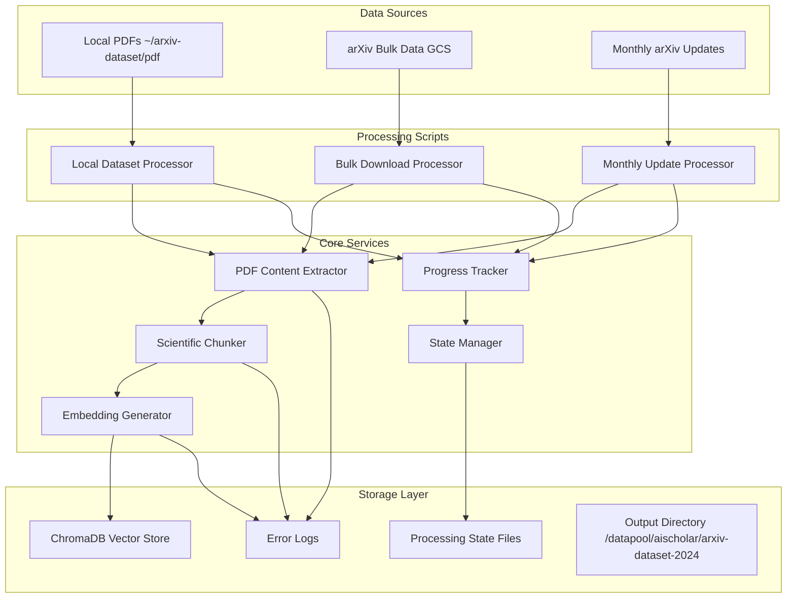

# Design Document

## Overview

The arXiv RAG Enhancement system consists of three Python scripts that extend the existing AI Scholar RAG infrastructure to process scientific papers from arXiv. The system leverages arXiv's bulk data access via Google Cloud Storage, integrates with the existing ChromaDB vector store, and provides robust progress tracking and error handling for large-scale document processing.

## Architecture

### High-Level Architecture



### System Integration

The scripts integrate with existing AI Scholar components:
- **VectorStoreService**: Reuses existing ChromaDB connection and embedding model
- **ScientificPDFProcessor**: Leverages existing PDF content extraction
- **ScientificRAGService**: Uses existing chunking strategies
- **OllamaService**: Benefits from enhanced document corpus for better responses

## Components and Interfaces

### 1. ArxivLocalProcessor

**Purpose**: Process existing PDFs from local dataset

**Key Components**:
- `PDFDiscovery`: Recursively finds PDF files in source directory
- `ProcessingQueue`: Manages batch processing with concurrency control
- `StateManager`: Tracks processed files and enables resume functionality
- `ProgressTracker`: Real-time progress display and ETA calculation

**Interface**:
```python
class ArxivLocalProcessor:
    def __init__(self, source_dir: str, output_dir: str, batch_size: int = 10)
    async def initialize_services(self) -> bool
    async def process_dataset(self, max_files: Optional[int] = None) -> bool
    async def resume_processing(self) -> bool
    def get_processing_stats(self) -> Dict[str, Any]
```

### 2. ArxivBulkDownloader

**Purpose**: Download and process papers from arXiv bulk data repository

**Key Components**:
- `ArxivAPIClient`: Interface to arXiv metadata API for paper discovery
- `GCSDownloader`: Downloads PDFs from Google Cloud Storage bulk repository
- `CategoryFilter`: Filters papers by specified arXiv categories
- `DateRangeFilter`: Filters papers by publication date (July 2024 onwards)
- `DuplicateDetector`: Prevents reprocessing of existing papers

**Interface**:
```python
class ArxivBulkDownloader:
    def __init__(self, categories: List[str], start_date: datetime, output_dir: str)
    async def discover_papers(self) -> List[ArxivPaper]
    async def download_papers(self, papers: List[ArxivPaper]) -> List[str]
    async def process_downloaded_papers(self, pdf_paths: List[str]) -> bool
    def get_download_stats(self) -> Dict[str, Any]
```

### 3. ArxivMonthlyUpdater

**Purpose**: Automated monthly updates of new arXiv papers

**Key Components**:
- `ScheduleManager`: Handles cron-like scheduling configuration
- `NewPaperDetector`: Identifies papers published in the previous month
- `UpdateProcessor`: Processes new papers and integrates with existing corpus
- `ReportGenerator`: Creates summary reports of update activities

**Interface**:
```python
class ArxivMonthlyUpdater:
    def __init__(self, categories: List[str], output_dir: str)
    async def run_monthly_update(self) -> UpdateReport
    async def setup_scheduling(self, cron_expression: str) -> bool
    def generate_update_report(self) -> UpdateReport
    async def cleanup_old_data(self, retention_days: int) -> bool
```

### 4. Shared Infrastructure Components

#### StateManager
Handles persistence of processing state for resume functionality:
```python
class StateManager:
    def save_state(self, processor_id: str, state: ProcessingState) -> bool
    def load_state(self, processor_id: str) -> Optional[ProcessingState]
    def clear_state(self, processor_id: str) -> bool
    def get_lock(self, processor_id: str) -> FileLock
```

#### ProgressTracker
Provides real-time progress monitoring:
```python
class ProgressTracker:
    def start_tracking(self, total_items: int) -> None
    def update_progress(self, completed: int, current_item: str) -> None
    def get_stats(self) -> ProgressStats
    def estimate_completion(self) -> datetime
```

#### ErrorHandler
Centralized error handling and logging:
```python
class ErrorHandler:
    def log_error(self, error: Exception, context: Dict[str, Any]) -> None
    def log_failed_file(self, file_path: str, error: str) -> None
    def get_error_summary(self) -> ErrorSummary
    def export_error_report(self, output_path: str) -> bool
```

## Data Models

### ProcessingState
```python
@dataclass
class ProcessingState:
    processor_id: str
    start_time: datetime
    last_update: datetime
    processed_files: Set[str]
    failed_files: Dict[str, str]  # file_path -> error_message
    current_batch: int
    total_files: int
    processing_stats: ProcessingStats
```

### ArxivPaper
```python
@dataclass
class ArxivPaper:
    arxiv_id: str
    title: str
    authors: List[str]
    categories: List[str]
    published_date: datetime
    updated_date: datetime
    abstract: str
    pdf_url: str
    metadata: Dict[str, Any]
```

### ProcessingStats
```python
@dataclass
class ProcessingStats:
    total_files: int
    processed_count: int
    failed_count: int
    skipped_count: int
    processing_rate: float  # files per second
    estimated_completion: Optional[datetime]
    current_file: str
    errors: List[ProcessingError]
```

### UpdateReport
```python
@dataclass
class UpdateReport:
    update_date: datetime
    papers_discovered: int
    papers_downloaded: int
    papers_processed: int
    papers_failed: int
    storage_used: int  # bytes
    processing_time: float  # seconds
    errors: List[str]
    summary: str
```

## arXiv Bulk Data Access Strategy

### Data Source
- **Primary**: arXiv bulk data on Google Cloud Storage (gs://arxiv-dataset/)
- **Metadata**: arXiv API for paper metadata and filtering
- **Categories**: cond-mat, gr-qc, hep-ph, hep-th, math, math-ph, physics, q-alg, quant-ph

### Access Pattern
1. **Discovery Phase**: Query arXiv API for paper metadata in target categories and date range
2. **Download Phase**: Download PDFs from GCS using gsutil or Google Cloud Storage client
3. **Processing Phase**: Extract content and create embeddings using existing infrastructure

### Rate Limiting and Etiquette
- Respect arXiv API rate limits (3 seconds between requests)
- Use bulk download for efficiency
- Implement exponential backoff for failed requests
- Cache metadata to minimize API calls

## Integration with Existing Infrastructure

### ChromaDB Vector Store
- **Collection Strategy**: Use existing "scientific_papers" collection or create category-specific collections
- **Metadata Schema**: Extend existing metadata with arXiv-specific fields (arxiv_id, categories, etc.)
- **Embedding Model**: Continue using "all-MiniLM-L6-v2" for consistency

### Scientific PDF Processor
- **Content Extraction**: Leverage existing `scientific_pdf_processor.extract_comprehensive_content()`
- **Chunking Strategy**: Use existing `scientific_rag_service._create_scientific_chunks()`
- **Error Handling**: Extend existing error handling for arXiv-specific issues

### File Organization
```
/datapool/aischolar/arxiv-dataset-2024/
├── pdfs/
│   ├── cond-mat/
│   ├── gr-qc/
│   ├── hep-ph/
│   └── ...
├── processed/
│   ├── state_files/
│   ├── error_logs/
│   └── reports/
└── metadata/
    ├── paper_index.json
    └── category_stats.json
```

## Error Handling

### Error Categories
1. **Network Errors**: Download failures, API timeouts
2. **File Errors**: Corrupted PDFs, permission issues
3. **Processing Errors**: PDF parsing failures, embedding generation issues
4. **Storage Errors**: Disk space, ChromaDB connection issues

### Error Recovery Strategies
- **Retry Logic**: Exponential backoff for transient failures
- **Graceful Degradation**: Continue processing other files when one fails
- **State Persistence**: Save progress frequently to enable recovery
- **Error Reporting**: Detailed logs with context for debugging

### Error Logging Format
```python
{
    "timestamp": "2024-01-15T10:30:00Z",
    "error_type": "pdf_processing_error",
    "file_path": "/path/to/paper.pdf",
    "arxiv_id": "2401.12345",
    "error_message": "Failed to extract text from PDF",
    "stack_trace": "...",
    "context": {
        "processor": "ArxivLocalProcessor",
        "batch_id": "batch_001",
        "retry_count": 2
    }
}
```

## Testing Strategy

### Unit Testing
- **Component Testing**: Test individual processors, downloaders, and utilities
- **Mock Services**: Mock arXiv API and GCS for reliable testing
- **Error Simulation**: Test error handling with simulated failures

### Integration Testing
- **End-to-End**: Test complete pipeline from download to vector store
- **State Management**: Test resume functionality with interrupted processing
- **Performance**: Test with large datasets to validate scalability

### Performance Testing
- **Throughput**: Measure processing rate with different batch sizes
- **Memory Usage**: Monitor memory consumption during large batch processing
- **Storage Efficiency**: Validate embedding storage and retrieval performance

## Security Considerations

### Data Privacy
- **Local Processing**: All processing occurs locally, no data sent to external services
- **Access Control**: Implement proper file permissions for processed data
- **Audit Trail**: Log all processing activities for compliance

### Network Security
- **HTTPS**: Use secure connections for arXiv API and GCS access
- **Authentication**: Implement proper GCS authentication if required
- **Rate Limiting**: Respect service limits to avoid being blocked

## Performance Optimization

### Processing Optimization
- **Batch Processing**: Process multiple files concurrently
- **Memory Management**: Stream large files to avoid memory issues
- **Caching**: Cache embeddings and metadata to avoid reprocessing

### Storage Optimization
- **Compression**: Compress processed data where appropriate
- **Indexing**: Optimize ChromaDB indices for query performance
- **Cleanup**: Implement data retention policies for old processed files

## Monitoring and Observability

### Metrics Collection
- **Processing Metrics**: Files processed, success/failure rates, processing time
- **System Metrics**: CPU, memory, disk usage during processing
- **Error Metrics**: Error rates by type, recovery success rates

### Logging Strategy
- **Structured Logging**: JSON format for easy parsing and analysis
- **Log Levels**: Appropriate use of DEBUG, INFO, WARN, ERROR levels
- **Log Rotation**: Prevent log files from consuming excessive disk space

### Health Checks
- **Service Health**: Monitor ChromaDB and embedding model availability
- **Data Quality**: Validate processed documents and embeddings
- **Storage Health**: Monitor disk space and storage performance