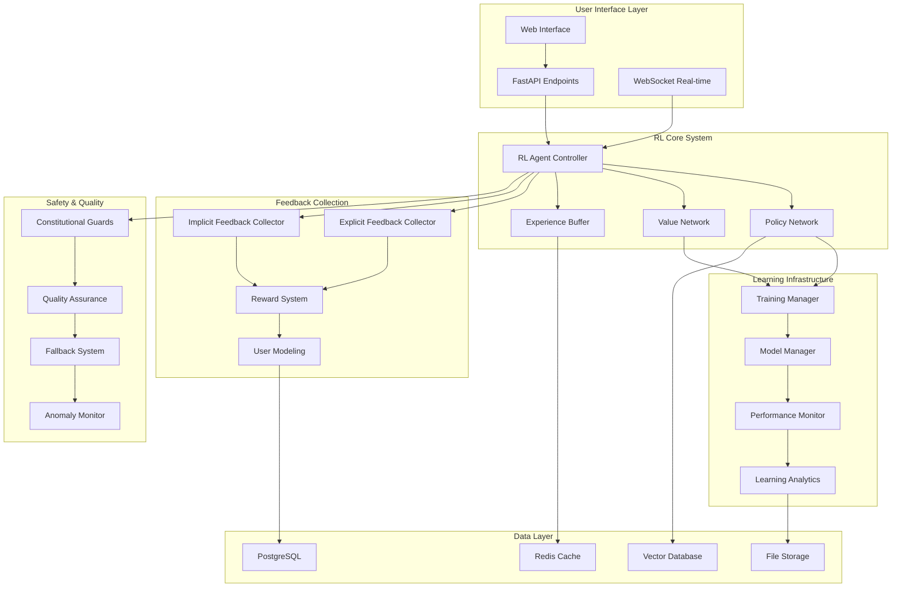

# Chatbot Reinforcement Learning Design

## Overview

This design document outlines the implementation of a sophisticated reinforcement learning system for the AI Scholar chatbot. The system will use a hybrid approach combining Proximal Policy Optimization (PPO), Constitutional AI principles, and multi-objective reward modeling to create an adaptive, safe, and highly effective research assistant.

The RL system will integrate seamlessly with the existing AI Scholar architecture, leveraging the current FastAPI backend, Redis caching, and multi-modal AI capabilities while adding new components for continuous learning and adaptation.

## Architecture

### High-Level System Architecture



### Component Integration with Existing System

The RL system will integrate with existing AI Scholar components:

- **FastAPI Backend**: New RL endpoints will be added to existing API structure
- **Redis**: Used for caching RL states, experiences, and user sessions
- **PostgreSQL**: Stores user profiles, feedback history, and learning analytics
- **Vector Database**: Stores conversation embeddings and semantic similarity data
- **Existing AI Services**: RAG system, knowledge graphs, and multi-modal processing

## Components and Interfaces

### 1. RL Agent Controller

**Purpose**: Central orchestrator for all RL operations

**Key Responsibilities**:
- Coordinate between policy network, value network, and experience collection
- Manage conversation state and context
- Interface with existing AI Scholar services
- Handle real-time decision making

**Interface**:
```python
class RLAgentController:
    async def generate_response(
        self, 
        user_input: str, 
        conversation_context: ConversationContext,
        user_profile: UserProfile
    ) -> RLResponse
    
    async def process_feedback(
        self, 
        feedback: UserFeedback, 
        conversation_id: str
    ) -> None
    
    async def update_policy(self, training_batch: List[Experience]) -> None
```

### 2. Policy Network

**Purpose**: Neural network that determines response generation strategies

**Architecture**:
- Transformer-based architecture (GPT-style)
- Multi-head attention for context understanding
- Specialized heads for different response types (technical, explanatory, creative)
- Constitutional AI constraints built into the architecture

**Key Features**:
- Contextual response strategy selection
- Personalization based on user expertise level
- Multi-objective optimization (helpfulness, accuracy, engagement)
- Safe exploration with constitutional constraints

**Interface**:
```python
class PolicyNetwork:
    def forward(
        self, 
        conversation_state: torch.Tensor,
        user_embedding: torch.Tensor,
        context_embedding: torch.Tensor
    ) -> PolicyOutput
    
    def get_action_probabilities(
        self, 
        state: ConversationState
    ) -> Dict[str, float]
```

### 3. Value Network

**Purpose**: Estimates the long-term value of conversation states

**Architecture**:
- Shared encoder with policy network
- Separate value head for state evaluation
- Multi-objective value estimation (user satisfaction, learning effectiveness, engagement)

**Interface**:
```python
class ValueNetwork:
    def estimate_value(
        self, 
        conversation_state: ConversationState,
        user_context: UserContext
    ) -> ValueEstimate
    
    def predict_outcome(
        self, 
        current_state: ConversationState,
        proposed_action: Action
    ) -> OutcomePrediction
```

### 4. Experience Buffer

**Purpose**: Stores and manages conversation experiences for training

**Features**:
- Prioritized experience replay
- Conversation-level experience grouping
- Privacy-preserving storage with user consent
- Efficient sampling for training

**Interface**:
```python
class ExperienceBuffer:
    async def store_experience(
        self, 
        experience: ConversationExperience
    ) -> None
    
    async def sample_batch(
        self, 
        batch_size: int,
        priority_sampling: bool = True
    ) -> List[ConversationExperience]
    
    async def update_priorities(
        self, 
        experience_ids: List[str],
        td_errors: List[float]
    ) -> None
```

### 5. Reward System

**Purpose**: Multi-objective reward calculation from various feedback sources

**Reward Components**:
- **Explicit Feedback**: Direct user ratings and feedback
- **Implicit Feedback**: Engagement metrics, follow-up questions, task completion
- **Quality Metrics**: Factual accuracy, relevance, helpfulness
- **Safety Metrics**: Constitutional AI compliance, harm prevention
- **Learning Metrics**: Knowledge transfer effectiveness, skill development

**Interface**:
```python
class RewardSystem:
    def calculate_reward(
        self, 
        conversation_turn: ConversationTurn,
        feedback: FeedbackCollection,
        quality_metrics: QualityMetrics
    ) -> MultiObjectiveReward
    
    def get_reward_breakdown(
        self, 
        reward: MultiObjectiveReward
    ) -> Dict[str, float]
```

### 6. User Modeling System

**Purpose**: Maintains and updates user profiles for personalization

**Features**:
- Expertise level tracking across domains
- Learning style preferences
- Interaction pattern analysis
- Privacy-preserving profile updates

**Interface**:
```python
class UserModelingSystem:
    async def update_user_profile(
        self, 
        user_id: str,
        interaction_data: InteractionData
    ) -> UserProfile
    
    async def get_personalization_context(
        self, 
        user_id: str
    ) -> PersonalizationContext
    
    async def infer_expertise_level(
        self, 
        user_id: str,
        domain: str
    ) -> ExpertiseLevel
```

## Data Models

### Core RL Data Structures

```python
@dataclass
class ConversationState:
    conversation_id: str
    turn_number: int
    user_input: str
    conversation_history: List[ConversationTurn]
    user_profile: UserProfile
    context_embeddings: torch.Tensor
    timestamp: datetime

@dataclass
class ConversationExperience:
    state: ConversationState
    action: Action
    reward: MultiObjectiveReward
    next_state: ConversationState
    done: bool
    metadata: Dict[str, Any]

@dataclass
class UserFeedback:
    feedback_type: FeedbackType  # EXPLICIT, IMPLICIT, QUALITY
    rating: Optional[float]
    text_feedback: Optional[str]
    engagement_metrics: EngagementMetrics
    timestamp: datetime

@dataclass
class MultiObjectiveReward:
    helpfulness: float
    accuracy: float
    engagement: float
    safety: float
    learning_effectiveness: float
    total_reward: float
    weights: Dict[str, float]

@dataclass
class UserProfile:
    user_id: str
    expertise_levels: Dict[str, ExpertiseLevel]
    learning_preferences: LearningPreferences
    interaction_patterns: InteractionPatterns
    feedback_history: List[UserFeedback]
    last_updated: datetime
```

### Database Schema Extensions

```sql
-- RL-specific tables extending existing schema

CREATE TABLE rl_user_profiles (
    id UUID PRIMARY KEY DEFAULT gen_random_uuid(),
    user_id UUID REFERENCES users(id),
    expertise_levels JSONB,
    learning_preferences JSONB,
    interaction_patterns JSONB,
    created_at TIMESTAMP DEFAULT NOW(),
    updated_at TIMESTAMP DEFAULT NOW()
);

CREATE TABLE rl_conversations (
    id UUID PRIMARY KEY DEFAULT gen_random_uuid(),
    user_id UUID REFERENCES users(id),
    conversation_data JSONB,
    rl_metadata JSONB,
    created_at TIMESTAMP DEFAULT NOW()
);

CREATE TABLE rl_feedback (
    id UUID PRIMARY KEY DEFAULT gen_random_uuid(),
    conversation_id UUID REFERENCES rl_conversations(id),
    feedback_type VARCHAR(50),
    feedback_data JSONB,
    reward_components JSONB,
    created_at TIMESTAMP DEFAULT NOW()
);

CREATE TABLE rl_model_versions (
    id UUID PRIMARY KEY DEFAULT gen_random_uuid(),
    model_type VARCHAR(50), -- 'policy' or 'value'
    version_number INTEGER,
    model_path VARCHAR(500),
    performance_metrics JSONB,
    created_at TIMESTAMP DEFAULT NOW()
);
```

## Error Handling

### RL-Specific Error Scenarios

1. **Policy Network Failures**
   - Fallback to pre-trained safe responses
   - Gradual degradation with reduced personalization
   - Automatic model rollback on persistent failures

2. **Training Instabilities**
   - Early stopping on performance degradation
   - Gradient clipping and learning rate adjustment
   - Constitutional constraint violations trigger immediate halt

3. **Reward Signal Issues**
   - Missing feedback handling with default neutral rewards
   - Outlier detection and filtering for reward signals
   - Multi-source reward validation

4. **User Profile Corruption**
   - Profile validation and sanitization
   - Fallback to default profiles
   - Incremental profile reconstruction

### Error Recovery Strategies

```python
class RLErrorHandler:
    async def handle_policy_failure(
        self, 
        error: PolicyError,
        conversation_context: ConversationContext
    ) -> FallbackResponse
    
    async def handle_training_instability(
        self, 
        training_metrics: TrainingMetrics
    ) -> TrainingAction
    
    async def validate_reward_signal(
        self, 
        reward: MultiObjectiveReward
    ) -> ValidationResult
```

## Testing Strategy

### 1. Unit Testing

**Policy Network Testing**:
- Response quality consistency
- Constitutional constraint adherence
- Personalization accuracy
- Performance benchmarks

**Reward System Testing**:
- Multi-objective reward calculation
- Feedback integration accuracy
- Edge case handling
- Bias detection and mitigation

### 2. Integration Testing

**End-to-End RL Pipeline**:
- Complete conversation flow with RL
- Feedback collection and processing
- Model updates and deployment
- Performance monitoring

**Safety Testing**:
- Constitutional AI constraint validation
- Harmful content prevention
- Privacy protection verification
- Rollback mechanism testing

### 3. A/B Testing Framework

**Comparative Evaluation**:
- RL-enhanced vs. baseline responses
- Different reward function configurations
- Personalization effectiveness
- User satisfaction metrics

### 4. Simulation Testing

**Synthetic User Interactions**:
- Large-scale conversation simulation
- Edge case scenario testing
- Performance under load
- Long-term learning validation

### Test Implementation

```python
class RLTestSuite:
    async def test_policy_consistency(self) -> TestResults
    async def test_reward_calculation(self) -> TestResults
    async def test_safety_constraints(self) -> TestResults
    async def test_personalization_accuracy(self) -> TestResults
    async def test_end_to_end_pipeline(self) -> TestResults
    
    async def run_ab_test(
        self, 
        test_config: ABTestConfig
    ) -> ABTestResults
    
    async def simulate_user_interactions(
        self, 
        simulation_config: SimulationConfig
    ) -> SimulationResults
```

## Performance Considerations

### Computational Efficiency

1. **Model Optimization**
   - Quantization for inference speed
   - Batch processing for training
   - Caching for frequent patterns
   - Asynchronous processing

2. **Memory Management**
   - Experience buffer size limits
   - Gradient accumulation strategies
   - Model checkpointing
   - Efficient data structures

3. **Scalability**
   - Distributed training support
   - Load balancing for inference
   - Horizontal scaling capabilities
   - Resource monitoring and auto-scaling

### Real-time Requirements

- **Response Time**: <2 seconds for RL-enhanced responses
- **Training Latency**: Batch updates every 1000 interactions
- **Model Updates**: Hot-swapping without service interruption
- **Feedback Processing**: Real-time reward calculation and storage

## Security and Privacy

### Privacy Protection

1. **Data Minimization**
   - Only store necessary conversation data
   - Automatic data expiration policies
   - User consent for data usage
   - Anonymization techniques

2. **Secure Storage**
   - Encrypted experience buffer
   - Secure model storage
   - Access control and audit logs
   - GDPR compliance measures

### Safety Measures

1. **Constitutional AI Integration**
   - Built-in ethical constraints
   - Harmful content detection
   - Bias monitoring and mitigation
   - Regular safety audits

2. **Model Security**
   - Adversarial robustness testing
   - Input validation and sanitization
   - Model integrity verification
   - Secure model deployment

## Deployment Strategy

### Phased Rollout

1. **Phase 1: Core Infrastructure** (Weeks 1-2)
   - Basic RL components implementation
   - Integration with existing system
   - Initial testing and validation

2. **Phase 2: Feedback Collection** (Weeks 3-4)
   - Explicit and implicit feedback systems
   - Reward calculation implementation
   - User profile management

3. **Phase 3: Learning Pipeline** (Weeks 5-6)
   - Training infrastructure setup
   - Model update mechanisms
   - Performance monitoring

4. **Phase 4: Production Deployment** (Weeks 7-8)
   - A/B testing framework
   - Gradual user rollout
   - Monitoring and optimization

### Monitoring and Maintenance

```python
class RLMonitoringSystem:
    async def monitor_model_performance(self) -> PerformanceMetrics
    async def detect_anomalies(self) -> List[Anomaly]
    async def generate_learning_reports(self) -> LearningReport
    async def track_user_satisfaction(self) -> SatisfactionMetrics
```

This design provides a comprehensive, production-ready reinforcement learning system that will significantly enhance the AI Scholar chatbot's capabilities while maintaining safety, privacy, and performance standards.