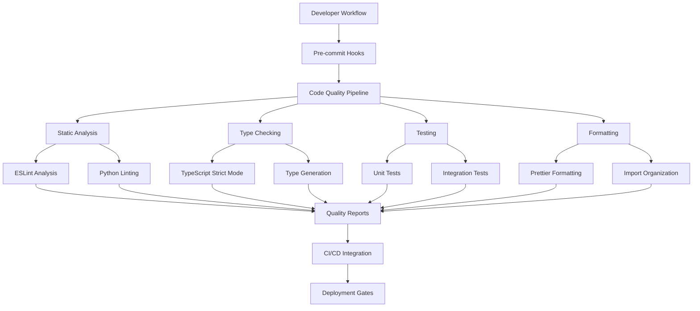

# Design Document

## Overview

This design document outlines a comprehensive code quality improvement system for the AI Scholar RAG chatbot project. The system addresses critical issues identified in the codebase including 740+ ESLint violations, extensive use of `any` types, unused variables, missing React hook dependencies, and inconsistent error handling patterns. The solution implements automated quality enforcement, type safety improvements, and systematic technical debt reduction.

## Architecture

### High-Level Architecture



### Component Architecture

The code quality system consists of several interconnected components:

1. **Static Analysis Engine**: Performs comprehensive code analysis
2. **Type Safety Enforcer**: Ensures TypeScript type safety
3. **Automated Formatter**: Maintains consistent code style
4. **Testing Framework**: Validates code functionality and quality
5. **Quality Metrics Collector**: Tracks and reports quality metrics
6. **Developer Tools Integration**: Provides IDE and workflow integration

## Components and Interfaces

### 1. Static Analysis Engine

**Purpose**: Analyze code for quality issues, security vulnerabilities, and best practice violations.

**Key Components**:
- ESLint configuration with custom rules
- Python linting with flake8, black, and mypy
- Security analysis with semgrep
- Complexity analysis and code smell detection

**Interfaces**:
```typescript
interface StaticAnalysisResult {
  file: string;
  issues: QualityIssue[];
  metrics: CodeMetrics;
  suggestions: Suggestion[];
}

interface QualityIssue {
  type: 'error' | 'warning' | 'info';
  rule: string;
  message: string;
  line: number;
  column: number;
  severity: number;
  fixable: boolean;
}
```

### 2. Type Safety Enforcer

**Purpose**: Eliminate `any` types and enforce strict TypeScript typing throughout the codebase.

**Key Components**:
- TypeScript strict mode configuration
- Custom type definitions for external libraries
- Automated type inference and generation
- Interface extraction and consolidation

**Interfaces**:
```typescript
interface TypeSafetyReport {
  anyTypeUsages: AnyTypeUsage[];
  missingTypes: MissingTypeDefinition[];
  typeErrors: TypeScriptError[];
  suggestions: TypeSafetySuggestion[];
}

interface AnyTypeUsage {
  file: string;
  line: number;
  context: string;
  suggestedType: string;
  confidence: number;
}
```

### 3. Automated Formatter

**Purpose**: Maintain consistent code formatting and style across the entire codebase.

**Key Components**:
- Prettier configuration for TypeScript/JavaScript
- Black configuration for Python
- Import sorting and organization
- Custom formatting rules for project-specific patterns

**Configuration**:
```json
{
  "prettier": {
    "semi": true,
    "trailingComma": "es5",
    "singleQuote": true,
    "printWidth": 80,
    "tabWidth": 2,
    "useTabs": false
  }
}
```

### 4. Testing Framework Enhancement

**Purpose**: Improve test coverage, quality, and maintainability.

**Key Components**:
- Enhanced Vitest configuration with coverage reporting
- Test utilities and mocking improvements
- Integration test framework
- Performance testing capabilities

**Interfaces**:
```typescript
interface TestQualityMetrics {
  coverage: CoverageReport;
  testQuality: TestQualityScore;
  performance: PerformanceMetrics;
  maintainability: MaintainabilityScore;
}

interface CoverageReport {
  statements: number;
  branches: number;
  functions: number;
  lines: number;
  uncoveredFiles: string[];
}
```

### 5. Quality Metrics Collector

**Purpose**: Track, analyze, and report code quality metrics over time.

**Key Components**:
- Metrics collection service
- Quality dashboard
- Trend analysis
- Automated reporting

**Interfaces**:
```typescript
interface QualityMetrics {
  codeComplexity: ComplexityMetrics;
  maintainabilityIndex: number;
  technicalDebt: TechnicalDebtMetrics;
  testCoverage: CoverageMetrics;
  typesSafety: TypeSafetyMetrics;
}
```

## Data Models

### Code Quality Configuration

```typescript
interface CodeQualityConfig {
  eslint: ESLintConfig;
  typescript: TypeScriptConfig;
  prettier: PrettierConfig;
  testing: TestingConfig;
  python: PythonConfig;
  preCommitHooks: PreCommitConfig;
}

interface ESLintConfig {
  extends: string[];
  rules: Record<string, any>;
  overrides: ESLintOverride[];
  ignorePatterns: string[];
}

interface TypeScriptConfig {
  strict: boolean;
  noImplicitAny: boolean;
  strictNullChecks: boolean;
  noUnusedLocals: boolean;
  noUnusedParameters: boolean;
  exactOptionalPropertyTypes: boolean;
}
```

### Quality Issue Tracking

```typescript
interface QualityIssueTracker {
  issues: QualityIssue[];
  resolutions: IssueResolution[];
  metrics: QualityTrend[];
  reports: QualityReport[];
}

interface IssueResolution {
  issueId: string;
  resolution: 'fixed' | 'suppressed' | 'deferred';
  timestamp: Date;
  author: string;
  notes: string;
}
```

## Error Handling

### Frontend Error Handling Strategy

1. **React Error Boundaries**: Implement comprehensive error boundaries for component-level error catching
2. **API Error Handling**: Standardize error responses and user feedback
3. **Type-Safe Error Objects**: Define proper error interfaces instead of using `any`
4. **Logging Integration**: Implement structured logging for debugging

```typescript
interface ErrorBoundaryState {
  hasError: boolean;
  error: Error | null;
  errorInfo: ErrorInfo | null;
}

interface APIError {
  code: string;
  message: string;
  details?: Record<string, any>;
  timestamp: Date;
}
```

### Backend Error Handling Strategy

1. **Structured Exception Handling**: Implement consistent exception patterns
2. **Logging Framework**: Use structured logging with proper context
3. **Error Response Standardization**: Consistent API error responses
4. **Monitoring Integration**: Connect errors to monitoring systems

```python
from typing import Optional, Dict, Any
from dataclasses import dataclass
from datetime import datetime

@dataclass
class APIError:
    code: str
    message: str
    details: Optional[Dict[str, Any]] = None
    timestamp: datetime = datetime.now()
```

## Testing Strategy

### Frontend Testing Approach

1. **Unit Testing**: Component and utility function testing with Vitest
2. **Integration Testing**: API integration and user flow testing
3. **Type Testing**: Ensure TypeScript types work correctly
4. **Performance Testing**: Component rendering and bundle size testing

### Backend Testing Approach

1. **Unit Testing**: Service and utility function testing with pytest
2. **Integration Testing**: Database and API endpoint testing
3. **Type Testing**: mypy static type checking
4. **Performance Testing**: Load testing and profiling

### Test Quality Metrics

```typescript
interface TestQualityStandards {
  minimumCoverage: {
    statements: 80;
    branches: 75;
    functions: 85;
    lines: 80;
  };
  testNaming: RegExp;
  testStructure: TestStructureRules;
  mockingGuidelines: MockingRules;
}
```

## Implementation Phases

### Phase 1: Foundation Setup (Week 1-2)
- Configure enhanced ESLint rules and TypeScript strict mode
- Set up Prettier and automated formatting
- Implement pre-commit hooks with husky and lint-staged
- Configure Python linting tools (flake8, black, mypy)

### Phase 2: Type Safety Implementation (Week 3-4)
- Systematically replace `any` types with proper interfaces
- Create comprehensive type definitions
- Implement type-safe error handling
- Add TypeScript strict mode enforcement

### Phase 3: Code Quality Automation (Week 5-6)
- Implement automated quality checks in CI/CD
- Set up quality metrics collection and reporting
- Create quality dashboards and monitoring
- Implement automated issue detection and reporting

### Phase 4: Testing Enhancement (Week 7-8)
- Improve test coverage and quality
- Implement integration testing framework
- Add performance testing capabilities
- Create test quality metrics and reporting

### Phase 5: Documentation and Maintenance (Week 9-10)
- Generate comprehensive API documentation
- Create code quality guidelines and best practices
- Implement ongoing maintenance procedures
- Train team on new quality standards and tools

## Quality Gates and Metrics

### Automated Quality Gates

1. **Pre-commit Gates**:
   - No ESLint errors
   - TypeScript compilation success
   - Prettier formatting compliance
   - Basic test suite passes

2. **CI/CD Gates**:
   - Full test suite passes with minimum coverage
   - No high-severity security issues
   - Performance benchmarks met
   - Documentation updated

3. **Deployment Gates**:
   - All quality metrics above thresholds
   - Security scan passes
   - Performance tests pass
   - Manual review completed

### Key Performance Indicators

```typescript
interface QualityKPIs {
  codeQuality: {
    eslintErrors: number; // Target: 0
    typeScriptErrors: number; // Target: 0
    codeComplexity: number; // Target: < 10
    maintainabilityIndex: number; // Target: > 70
  };
  testing: {
    codeCoverage: number; // Target: > 80%
    testQuality: number; // Target: > 85%
    testExecutionTime: number; // Target: < 30s
  };
  performance: {
    bundleSize: number; // Target: < 2MB
    buildTime: number; // Target: < 60s
    typeCheckTime: number; // Target: < 30s
  };
}
```

## Tools and Technologies

### Frontend Quality Tools
- **ESLint**: Static analysis and linting
- **TypeScript**: Type safety and compilation
- **Prettier**: Code formatting
- **Vitest**: Testing framework
- **Husky**: Git hooks management
- **lint-staged**: Pre-commit file processing

### Backend Quality Tools
- **flake8**: Python linting
- **black**: Python code formatting
- **mypy**: Python static type checking
- **pytest**: Testing framework
- **bandit**: Security analysis
- **coverage.py**: Test coverage analysis

### Integration and Monitoring
- **GitHub Actions**: CI/CD automation
- **SonarQube**: Code quality analysis
- **CodeClimate**: Maintainability analysis
- **Sentry**: Error monitoring and tracking
- **Lighthouse**: Performance monitoring