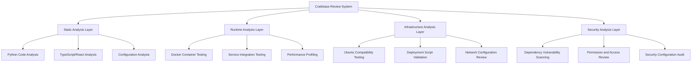

# Design Document

## Overview

This design outlines a comprehensive approach to reviewing and improving the AI Scholar codebase for Ubuntu server compatibility, error detection, and overall system reliability. The review will be conducted through automated analysis tools, manual code inspection, and systematic testing across multiple layers of the application stack.

The AI Scholar application is a complex RAG (Retrieval-Augmented Generation) system built with:
- **Backend**: Python FastAPI with extensive service architecture
- **Frontend**: React/TypeScript with Vite build system
- **Infrastructure**: Docker containers, Nginx reverse proxy, PostgreSQL, Redis, ChromaDB
- **Deployment**: Multi-environment Docker Compose configurations
- **Monitoring**: Prometheus, Grafana, comprehensive logging

## Architecture

### Review Architecture Components



### Analysis Workflow

1. **Preparation Phase**: Environment setup and tool configuration
2. **Static Analysis Phase**: Code quality, syntax, and structure analysis
3. **Dynamic Analysis Phase**: Runtime behavior and integration testing
4. **Infrastructure Analysis Phase**: Docker, networking, and deployment validation
5. **Security Analysis Phase**: Vulnerability scanning and security best practices
6. **Reporting Phase**: Consolidated findings and recommendations

## Components and Interfaces

### Static Analysis Tools

#### Python Backend Analysis
- **Flake8**: Style guide enforcement and error detection
- **Black**: Code formatting consistency
- **MyPy**: Type checking and annotation validation
- **Bandit**: Security vulnerability scanning
- **PyLint**: Comprehensive code quality analysis
- **Safety**: Dependency vulnerability checking

#### TypeScript/React Frontend Analysis
- **ESLint**: JavaScript/TypeScript linting with React-specific rules
- **TypeScript Compiler**: Type checking and compilation errors
- **Prettier**: Code formatting consistency
- **npm audit**: Dependency vulnerability scanning
- **Bundle Analyzer**: Build optimization analysis

#### Configuration Analysis
- **Docker Lint**: Dockerfile best practices validation
- **YAML Lint**: Docker Compose and configuration file validation
- **Shell Check**: Bash script analysis and Ubuntu compatibility
- **JSON Schema Validation**: Configuration file structure validation

### Dynamic Analysis Tools

#### Container Testing Framework
- **Docker Health Checks**: Service availability validation
- **Container Resource Monitoring**: Memory and CPU usage analysis
- **Network Connectivity Testing**: Inter-service communication validation
- **Volume Mount Testing**: File system permissions and access

#### Integration Testing Suite
- **API Endpoint Testing**: FastAPI route validation
- **Database Connection Testing**: PostgreSQL, Redis, ChromaDB connectivity
- **Authentication Flow Testing**: JWT token validation and user management
- **File Upload/Processing Testing**: Document processing pipeline validation

### Ubuntu Compatibility Validation

#### System Requirements Analysis
- **Package Dependencies**: Ubuntu 24.04.2 LTS compatibility matrix
- **Python Version Compatibility**: Python 3.11 on Ubuntu validation
- **Node.js Compatibility**: Node 20 LTS on Ubuntu validation
- **System Library Dependencies**: Native library availability check

#### Docker Environment Testing
- **Base Image Compatibility**: Ubuntu-based container validation
- **Package Installation**: apt-get package availability and versions
- **File System Permissions**: Ubuntu user/group permission handling
- **Network Configuration**: Ubuntu Docker networking validation

## Data Models

### Issue Classification Schema

```python
class IssueType(Enum):
    SYNTAX_ERROR = "syntax_error"
    TYPE_ERROR = "type_error"
    IMPORT_ERROR = "import_error"
    CONFIGURATION_ERROR = "configuration_error"
    SECURITY_VULNERABILITY = "security_vulnerability"
    PERFORMANCE_ISSUE = "performance_issue"
    UBUNTU_COMPATIBILITY = "ubuntu_compatibility"
    DOCKER_ISSUE = "docker_issue"
    DEPENDENCY_ISSUE = "dependency_issue"

class IssueSeverity(Enum):
    CRITICAL = "critical"  # Blocks deployment/functionality
    HIGH = "high"         # Significant impact on reliability
    MEDIUM = "medium"     # Moderate impact, should be fixed
    LOW = "low"          # Minor improvement opportunity
    INFO = "info"        # Informational, no action required

class CodeIssue(BaseModel):
    id: str
    type: IssueType
    severity: IssueSeverity
    file_path: str
    line_number: Optional[int]
    column_number: Optional[int]
    description: str
    recommendation: str
    ubuntu_specific: bool
    auto_fixable: bool
    related_issues: List[str]
```

### Compatibility Matrix

```python
class UbuntuCompatibility(BaseModel):
    ubuntu_version: str = "24.04.2"
    python_version: str = "3.11"
    node_version: str = "20"
    docker_version: str = "24.0+"
    
    system_packages: Dict[str, str]  # package_name -> required_version
    python_packages: Dict[str, str]  # package_name -> compatible_version
    node_packages: Dict[str, str]    # package_name -> compatible_version
    
    known_issues: List[str]
    workarounds: Dict[str, str]
```

## Error Handling

### Analysis Error Recovery

1. **Tool Failure Handling**: Continue analysis with remaining tools if one fails
2. **Partial Results Processing**: Generate reports even with incomplete analysis
3. **Timeout Management**: Set reasonable timeouts for long-running analysis
4. **Resource Constraint Handling**: Graceful degradation under resource limits

### Issue Prioritization Strategy

```python
def calculate_priority_score(issue: CodeIssue) -> float:
    base_scores = {
        IssueSeverity.CRITICAL: 100,
        IssueSeverity.HIGH: 75,
        IssueSeverity.MEDIUM: 50,
        IssueSeverity.LOW: 25,
        IssueSeverity.INFO: 10
    }
    
    multipliers = {
        IssueType.SYNTAX_ERROR: 1.5,
        IssueType.SECURITY_VULNERABILITY: 1.4,
        IssueType.UBUNTU_COMPATIBILITY: 1.3,
        IssueType.DOCKER_ISSUE: 1.2,
        # ... other types
    }
    
    score = base_scores[issue.severity]
    score *= multipliers.get(issue.type, 1.0)
    
    if issue.ubuntu_specific:
        score *= 1.2
    
    if issue.auto_fixable:
        score *= 0.9  # Slightly lower priority since it's easily fixed
    
    return score
```

## Testing Strategy

### Multi-Layer Testing Approach

#### Layer 1: Static Analysis Testing
- **Code Quality Gates**: Enforce minimum quality thresholds
- **Security Baseline**: Zero critical vulnerabilities policy
- **Style Consistency**: Automated formatting validation
- **Type Safety**: Comprehensive type checking coverage

#### Layer 2: Unit and Integration Testing
- **Service Isolation Testing**: Individual service functionality
- **API Contract Testing**: Endpoint specification compliance
- **Database Integration Testing**: Data layer functionality
- **Authentication Testing**: Security mechanism validation

#### Layer 3: System Integration Testing
- **End-to-End Workflows**: Complete user journey testing
- **Cross-Service Communication**: Inter-service dependency validation
- **Performance Under Load**: Stress testing with realistic data
- **Failure Recovery Testing**: Resilience and error handling validation

#### Layer 4: Ubuntu Environment Testing
- **Fresh Ubuntu Installation**: Clean environment deployment testing
- **Package Dependency Resolution**: System package availability
- **Container Runtime Testing**: Docker functionality on Ubuntu
- **Network Configuration Testing**: Ubuntu-specific networking

### Automated Testing Pipeline

```yaml
# Testing Pipeline Configuration
testing_pipeline:
  stages:
    - static_analysis:
        parallel: true
        jobs:
          - python_analysis
          - typescript_analysis
          - configuration_analysis
          - security_scanning
    
    - build_testing:
        depends_on: [static_analysis]
        jobs:
          - docker_build_test
          - frontend_build_test
          - dependency_resolution_test
    
    - integration_testing:
        depends_on: [build_testing]
        jobs:
          - service_integration_test
          - database_integration_test
          - api_contract_test
    
    - ubuntu_compatibility:
        depends_on: [integration_testing]
        jobs:
          - ubuntu_deployment_test
          - system_integration_test
          - performance_validation_test
```

### Performance Benchmarking

#### Baseline Metrics
- **API Response Times**: < 200ms for simple queries, < 2s for complex RAG operations
- **Memory Usage**: < 2GB per service container under normal load
- **CPU Utilization**: < 70% average, < 90% peak
- **Database Query Performance**: < 100ms for simple queries, < 1s for complex analytics

#### Ubuntu-Specific Performance Considerations
- **File System Performance**: ext4 vs other file systems impact
- **Container Overlay Performance**: Docker storage driver optimization
- **Network Stack Performance**: Ubuntu networking configuration impact
- **Memory Management**: Ubuntu memory allocation patterns

## Implementation Phases

### Phase 1: Analysis Tool Setup and Configuration
- Configure static analysis tools with project-specific rules
- Set up Ubuntu testing environment (VM or container)
- Establish baseline metrics and quality gates
- Create automated reporting infrastructure

### Phase 2: Comprehensive Code Analysis
- Execute static analysis across all code components
- Identify and categorize all issues by type and severity
- Generate detailed compatibility matrix for Ubuntu
- Document all findings with specific recommendations

### Phase 3: Dynamic Testing and Validation
- Deploy application in Ubuntu environment
- Execute integration and performance tests
- Validate Docker container behavior on Ubuntu
- Test deployment scripts and automation

### Phase 4: Issue Resolution and Optimization
- Implement fixes for critical and high-severity issues
- Optimize performance bottlenecks identified during testing
- Update documentation and deployment procedures
- Validate fixes through comprehensive re-testing

### Phase 5: Continuous Monitoring Setup
- Implement automated quality gates in CI/CD pipeline
- Set up ongoing Ubuntu compatibility monitoring
- Create alerting for regression detection
- Establish maintenance procedures for ongoing code quality