# Design Document

## Overview

This design outlines the implementation of all missing advanced features for the AI Scholar Advanced RAG system. The design focuses on mobile accessibility, voice interfaces, external integrations, educational enhancements, enterprise compliance, interactive content support, and funding/publication matching. The implementation will extend the existing architecture while maintaining compatibility and performance.

## Architecture

### High-Level Architecture

```mermaid
graph TB
    subgraph "Mobile Layer"
        MA[Mobile App]
        PWA[Progressive Web App]
        MSync[Mobile Sync Service]
    end
    
    subgraph "Voice Interface Layer"
        STT[Speech-to-Text]
        TTS[Text-to-Speech]
        VC[Voice Commands]
        VNL[Voice NLP]
    end
    
    subgraph "Integration Layer"
        RM[Reference Managers]
        NT[Note-Taking Apps]
        AD[Academic Databases]
        WT[Writing Tools]
        IS[Integration Service]
    end
    
    subgraph "Educational Layer"
        QG[Quiz Generator]
        SR[Spaced Repetition]
        PT[Progress Tracker]
        AL[Adaptive Learning]
    end
    
    subgraph "Enterprise Layer"
        CM[Compliance Monitor]
        IM[Institution Manager]
        RO[Resource Optimizer]
        AR[Admin Reports]
    end
    
    subgraph "Interactive Content Layer"
        JN[Jupyter Notebooks]
        IV[Interactive Viz]
        CS[Code Sandbox]
        VC[Version Control]
    end
    
    subgraph "Opportunity Matching Layer"
        FM[Funding Matcher]
        PM[Publication Matcher]
        GM[Grant Monitor]
        OM[Opportunity API]
    end
    
    subgraph "Core System"
        API[Backend API]
        DB[(Database)]
        KG[Knowledge Graph]
        AI[AI Services]
    end
    
    MA --> API
    PWA --> API
    STT --> VNL
    TTS --> API
    IS --> API
    QG --> AI
    CM --> DB
    JN --> CS
    FM --> OM
    
    API --> DB
    API --> KG
    API --> AI
```



## Components and Interfaces

### 1. Mobile Accessibility System

#### Mobile App Service
```python
class MobileAppService:
    async def sync_offline_data() -> SyncResult
    async def handle_push_notifications() -> NotificationResult
    async def optimize_for_mobile() -> OptimizationResult
    async def manage_offline_cache() -> CacheResult
```

#### Progressive Web App (PWA)
```python
class PWAService:
    async def register_service_worker() -> ServiceWorkerResult
    async def cache_critical_resources() -> CacheResult
    async def handle_offline_requests() -> OfflineResult
    async def sync_when_online() -> SyncResult
```

#### Accessibility Service
```python
class AccessibilityService:
    async def generate_aria_labels() -> AccessibilityResult
    async def optimize_for_screen_readers() -> ScreenReaderResult
    async def provide_keyboard_navigation() -> NavigationResult
    async def support_high_contrast() -> ContrastResult
```

### 2. Voice Interface System

#### Speech Processing Service
```python
class SpeechProcessingService:
    async def speech_to_text(audio_data: bytes) -> TranscriptionResult
    async def text_to_speech(text: str, voice_config: VoiceConfig) -> AudioResult
    async def detect_language(audio_data: bytes) -> LanguageResult
    async def filter_noise(audio_data: bytes) -> FilteredAudioResult
```

#### Voice Command Handler
```python
class VoiceCommandHandler:
    async def parse_voice_command(text: str) -> CommandResult
    async def execute_voice_action(command: VoiceCommand) -> ActionResult
    async def provide_voice_feedback(result: Any) -> VoiceFeedbackResult
    async def maintain_conversation_context() -> ContextResult
```

### 3. External Integration System

#### Reference Manager Integration
```python
class ReferenceManagerService:
    async def sync_zotero_library(credentials: ZoteroAuth) -> SyncResult
    async def sync_mendeley_library(credentials: MendeleyAuth) -> SyncResult
    async def sync_endnote_library(credentials: EndNoteAuth) -> SyncResult
    async def export_to_reference_manager(data: BibliographicData) -> ExportResult
```

#### Academic Database Integration
```python
class AcademicDatabaseService:
    async def search_pubmed(query: str) -> PubMedResults
    async def search_arxiv(query: str) -> ArXivResults
    async def search_google_scholar(query: str) -> ScholarResults
    async def import_paper_metadata(paper_id: str) -> PaperMetadata
```

#### Note-Taking Integration
```python
class NoteTakingIntegration:
    async def sync_obsidian_vault(vault_config: ObsidianConfig) -> SyncResult
    async def sync_notion_workspace(notion_config: NotionConfig) -> SyncResult
    async def sync_roam_graph(roam_config: RoamConfig) -> SyncResult
    async def export_knowledge_graph(format: ExportFormat) -> ExportResult
```

### 4. Educational Enhancement System

#### Quiz Generation Service
```python
class QuizGenerationService:
    async def generate_quiz_from_content(content: str) -> QuizResult
    async def create_multiple_choice_questions(content: str) -> MCQResult
    async def create_short_answer_questions(content: str) -> SAQResult
    async def create_essay_questions(content: str) -> EssayResult
    async def evaluate_quiz_responses(responses: QuizResponses) -> EvaluationResult
```

#### Spaced Repetition Service
```python
class SpacedRepetitionService:
    async def calculate_next_review_date(item: StudyItem) -> ReviewDate
    async def adjust_difficulty_based_on_performance(performance: Performance) -> DifficultyAdjustment
    async def generate_study_schedule(user_goals: StudyGoals) -> StudySchedule
    async def track_learning_progress(user_id: str) -> ProgressReport
```

### 5. Enterprise Compliance System

#### Compliance Monitor
```python
class ComplianceMonitorService:
    async def check_institutional_guidelines(research_data: ResearchData) -> ComplianceResult
    async def monitor_ethical_compliance(research_proposal: ResearchProposal) -> EthicsResult
    async def track_resource_usage(user_id: str) -> UsageReport
    async def generate_compliance_report(institution_id: str) -> ComplianceReport
```

#### Institution Management
```python
class InstitutionManagementService:
    async def manage_user_roles(institution_id: str) -> RoleManagementResult
    async def track_student_progress(student_id: str) -> ProgressReport
    async def optimize_resource_allocation(usage_data: UsageData) -> OptimizationResult
    async def generate_institutional_metrics(institution_id: str) -> MetricsReport
```

### 6. Interactive Content System

#### Jupyter Notebook Service
```python
class JupyterNotebookService:
    async def execute_notebook_cells(notebook: NotebookData) -> ExecutionResult
    async def render_interactive_widgets(widgets: WidgetData) -> RenderResult
    async def manage_notebook_dependencies(requirements: Requirements) -> DependencyResult
    async def provide_code_security_sandbox() -> SandboxResult
```

#### Interactive Visualization Service
```python
class InteractiveVisualizationService:
    async def render_plotly_charts(chart_data: PlotlyData) -> ChartResult
    async def render_d3_visualizations(d3_data: D3Data) -> VisualizationResult
    async def handle_user_interactions(interaction: UserInteraction) -> InteractionResult
    async def export_interactive_content(content: InteractiveContent) -> ExportResult
```

### 7. Opportunity Matching System

#### Funding Matcher Service
```python
class FundingMatcherService:
    async def match_funding_opportunities(research_profile: ResearchProfile) -> FundingMatches
    async def search_grant_databases(keywords: List[str]) -> GrantResults
    async def track_application_deadlines(user_id: str) -> DeadlineTracker
    async def calculate_funding_relevance_score(opportunity: FundingOpportunity) -> RelevanceScore
```

#### Publication Matcher Service
```python
class PublicationMatcherService:
    async def recommend_journals(paper_abstract: str) -> JournalRecommendations
    async def recommend_conferences(research_area: str) -> ConferenceRecommendations
    async def analyze_publication_fit(paper: PaperData, venue: PublicationVenue) -> FitScore
    async def track_submission_status(submission_id: str) -> SubmissionStatus
```

## Data Models

### Mobile and Accessibility Models
```python
@dataclass
class MobileSession:
    session_id: str
    device_info: DeviceInfo
    offline_cache: OfflineCache
    sync_status: SyncStatus
    last_sync: datetime

@dataclass
class AccessibilityPreferences:
    screen_reader_enabled: bool
    high_contrast_mode: bool
    font_size_multiplier: float
    keyboard_navigation_only: bool
    voice_feedback_enabled: bool
```

### Voice Interface Models
```python
@dataclass
class VoiceSession:
    session_id: str
    language: str
    voice_profile: VoiceProfile
    conversation_context: ConversationContext
    command_history: List[VoiceCommand]

@dataclass
class VoiceCommand:
    command_text: str
    intent: CommandIntent
    entities: List[Entity]
    confidence_score: float
    execution_result: Optional[CommandResult]
```

### Integration Models
```python
@dataclass
class ExternalIntegration:
    integration_id: str
    service_type: IntegrationType
    credentials: EncryptedCredentials
    sync_settings: SyncSettings
    last_sync: datetime
    sync_status: SyncStatus

@dataclass
class BibliographicData:
    title: str
    authors: List[str]
    journal: str
    year: int
    doi: str
    abstract: str
    keywords: List[str]
    citation_count: int
```

### Educational Models
```python
@dataclass
class Quiz:
    quiz_id: str
    content_source: str
    questions: List[Question]
    difficulty_level: DifficultyLevel
    estimated_time: int
    learning_objectives: List[str]

@dataclass
class StudySession:
    session_id: str
    user_id: str
    study_items: List[StudyItem]
    performance_metrics: PerformanceMetrics
    next_review_schedule: ReviewSchedule
```

### Enterprise Models
```python
@dataclass
class InstitutionalPolicy:
    policy_id: str
    institution_id: str
    policy_type: PolicyType
    rules: List[ComplianceRule]
    enforcement_level: EnforcementLevel
    effective_date: datetime

@dataclass
class ComplianceViolation:
    violation_id: str
    user_id: str
    policy_violated: str
    severity: ViolationSeverity
    description: str
    resolution_status: ResolutionStatus
```

## Error Handling

### Mobile and Offline Error Handling
- **Network Connectivity**: Graceful degradation to offline mode
- **Sync Conflicts**: Intelligent conflict resolution with user input
- **Storage Limitations**: Automatic cache management and cleanup
- **Device Compatibility**: Feature detection and fallback options

### Voice Interface Error Handling
- **Speech Recognition Failures**: Fallback to text input with error feedback
- **Audio Quality Issues**: Noise filtering and quality enhancement
- **Language Detection Errors**: Manual language selection options
- **Command Ambiguity**: Clarification requests and suggestion prompts

### Integration Error Handling
- **Authentication Failures**: Secure re-authentication flows
- **API Rate Limiting**: Intelligent request queuing and retry logic
- **Data Format Incompatibilities**: Robust data transformation and validation
- **Service Unavailability**: Graceful fallbacks and user notifications

## Security Considerations

### Mobile Security
- **Data Encryption**: End-to-end encryption for offline data
- **Secure Storage**: Encrypted local storage for sensitive information
- **Authentication**: Biometric authentication support
- **Network Security**: Certificate pinning and secure communication

### Voice Privacy
- **Audio Data Protection**: Local processing where possible
- **Voice Biometrics**: Secure voice profile storage
- **Conversation Privacy**: Encrypted conversation history
- **Consent Management**: Clear privacy controls and opt-out options

### Integration Security
- **Credential Management**: Secure OAuth token storage and refresh
- **Data Isolation**: Sandboxed integration environments
- **Audit Logging**: Comprehensive integration activity logging
- **Permission Management**: Granular access control for integrations

## Performance Optimization

### Mobile Performance
- **Lazy Loading**: Progressive content loading for mobile
- **Image Optimization**: Responsive images and compression
- **Caching Strategy**: Intelligent caching for offline access
- **Battery Optimization**: Efficient background processing

### Voice Processing Performance
- **Real-time Processing**: Low-latency speech recognition
- **Audio Compression**: Efficient audio data transmission
- **Model Optimization**: Lightweight models for mobile devices
- **Streaming Processing**: Continuous speech processing

### Integration Performance
- **Connection Pooling**: Efficient external API connections
- **Batch Processing**: Bulk data synchronization
- **Caching**: Intelligent caching of external data
- **Rate Limiting**: Respectful API usage patterns

This comprehensive design provides the foundation for implementing all missing advanced features while maintaining system integrity and performance.