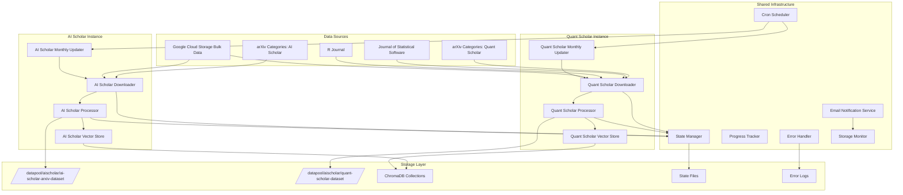

# Design Document

## Overview

The Multi-Instance ArXiv System extends the existing ArXiv RAG Enhancement infrastructure to support two separate scholar instances (AI Scholar and Quant Scholar) with automated monthly updates, comprehensive monitoring, and robust error handling. The system leverages the existing shared components while providing complete instance separation and specialized data source handling.

## Architecture

### High-Level Architecture



### Instance Separation Strategy

The system maintains complete separation between AI Scholar and Quant Scholar instances through:

1. **Separate Directory Structures**: Each instance uses dedicated storage paths
2. **Instance-Specific Configurations**: Separate YAML config files for each scholar type
3. **Isolated Vector Store Collections**: Separate ChromaDB collections with instance prefixes
4. **Independent State Management**: Separate state files and processing queues
5. **Dedicated Scripts**: Instance-specific entry point scripts

## Components and Interfaces

### 1. Multi-Instance Downloader Framework

**Purpose**: Extensible framework supporting multiple scholar instances with different data sources

**Key Components**:
- `BaseScholarDownloader`: Abstract base class for all scholar instances
- `AIScholarDownloader`: Specialized downloader for AI Scholar categories
- `QuantScholarDownloader`: Specialized downloader with journal source support
- `DataSourceManager`: Handles multiple data source types (arXiv, journals)
- `InstanceConfigManager`: Manages instance-specific configurations

**Interface**:
```python
class BaseScholarDownloader:
    def __init__(self, instance_name: str, config_path: str)
    async def initialize_instance(self) -> bool
    async def discover_papers(self, date_range: DateRange) -> List[Paper]
    async def download_papers(self, papers: List[Paper]) -> DownloadResult
    async def process_papers(self, pdf_paths: List[str]) -> ProcessingResult
    def get_instance_stats(self) -> InstanceStats

class AIScholarDownloader(BaseScholarDownloader):
    def __init__(self, config_path: str = "configs/ai_scholar.yaml")
    async def discover_arxiv_papers(self) -> List[ArxivPaper]

class QuantScholarDownloader(BaseScholarDownloader):
    def __init__(self, config_path: str = "configs/quant_scholar.yaml")
    async def discover_arxiv_papers(self) -> List[ArxivPaper]
    async def discover_journal_papers(self) -> List[JournalPaper]
```

### 2. Journal Source Handlers

**Purpose**: Specialized handlers for non-arXiv journal sources

**Key Components**:
- `JStatSoftwareHandler`: Handles Journal of Statistical Software downloads
- `RJournalHandler`: Handles R Journal downloads
- `JournalMetadataExtractor`: Extracts metadata from journal papers
- `JournalPDFDownloader`: Downloads PDFs from journal websites

**Interface**:
```python
class BaseJournalHandler:
    def __init__(self, base_url: str, instance_name: str)
    async def discover_papers(self, date_range: DateRange) -> List[JournalPaper]
    async def download_paper(self, paper: JournalPaper) -> str
    async def extract_metadata(self, pdf_path: str) -> Dict[str, Any]

class JStatSoftwareHandler(BaseJournalHandler):
    def __init__(self, instance_name: str)
    async def parse_issue_index(self) -> List[JournalPaper]
    async def download_from_jss(self, paper: JournalPaper) -> str

class RJournalHandler(BaseJournalHandler):
    def __init__(self, instance_name: str)
    async def parse_issue_archive(self) -> List[JournalPaper]
    async def download_from_rjournal(self, paper: JournalPaper) -> str
```

### 3. Enhanced Monthly Updater System

**Purpose**: Automated monthly updates with comprehensive reporting and monitoring

**Key Components**:
- `MonthlyUpdateOrchestrator`: Coordinates updates across all instances
- `InstanceUpdateManager`: Manages updates for individual scholar instances
- `UpdateReportGenerator`: Creates detailed HTML reports
- `EmailNotificationService`: Sends formatted email notifications
- `StorageMonitor`: Monitors disk usage and provides cleanup recommendations

**Interface**:
```python
class MonthlyUpdateOrchestrator:
    def __init__(self, config_path: str = "configs/monthly_updates.yaml")
    async def run_monthly_updates(self) -> List[UpdateReport]
    async def schedule_updates(self, cron_expression: str) -> bool
    async def send_consolidated_report(self, reports: List[UpdateReport]) -> bool

class InstanceUpdateManager:
    def __init__(self, instance_name: str, downloader: BaseScholarDownloader)
    async def run_instance_update(self) -> UpdateReport
    async def cleanup_old_files(self, retention_days: int) -> CleanupReport
    async def validate_instance_health(self) -> HealthReport
```

### 4. Advanced Email Notification System

**Purpose**: Rich HTML email notifications with charts and detailed reporting

**Key Components**:
- `HTMLReportGenerator`: Creates rich HTML reports with embedded charts
- `EmailTemplateManager`: Manages email templates for different notification types
- `ChartGenerator`: Creates processing statistics charts and visualizations
- `NotificationScheduler`: Manages different notification priorities and schedules

**Interface**:
```python
class EmailNotificationService:
    def __init__(self, smtp_config: Dict[str, Any])
    async def send_update_report(self, report: UpdateReport, recipients: List[str]) -> bool
    async def send_error_alert(self, error_summary: ErrorSummary, priority: str) -> bool
    async def send_storage_warning(self, storage_stats: StorageStats) -> bool
    def generate_html_report(self, data: Dict[str, Any], template: str) -> str

class HTMLReportGenerator:
    def create_processing_summary(self, stats: ProcessingStats) -> str
    def create_error_analysis(self, errors: List[ProcessingError]) -> str
    def create_storage_charts(self, storage_data: StorageStats) -> str
    def create_trend_analysis(self, historical_data: List[UpdateReport]) -> str
```

### 5. Storage Management and Monitoring

**Purpose**: Automated storage monitoring, cleanup, and optimization

**Key Components**:
- `StorageMonitor`: Real-time storage monitoring and alerting
- `DataRetentionManager`: Manages data retention policies and cleanup
- `CompressionManager`: Handles data compression and archival
- `StorageOptimizer`: Optimizes storage layout and performance

**Interface**:
```python
class StorageMonitor:
    def __init__(self, monitored_paths: List[str])
    async def check_storage_usage(self) -> StorageStats
    async def predict_storage_needs(self, growth_rate: float) -> StoragePrediction
    async def generate_cleanup_recommendations(self) -> List[CleanupRecommendation]
    def set_storage_thresholds(self, warning: float, critical: float) -> None

class DataRetentionManager:
    def __init__(self, retention_policies: Dict[str, int])
    async def cleanup_old_files(self, instance_name: str) -> CleanupReport
    async def archive_processed_data(self, cutoff_date: datetime) -> ArchiveReport
    async def validate_retention_compliance(self) -> ComplianceReport
```

## Data Models

### Enhanced Paper Models

```python
@dataclass
class BasePaper:
    paper_id: str
    title: str
    authors: List[str]
    abstract: str
    published_date: datetime
    source_type: str  # 'arxiv', 'journal'
    instance_name: str  # 'ai_scholar', 'quant_scholar'
    metadata: Dict[str, Any]

@dataclass
class ArxivPaper(BasePaper):
    arxiv_id: str
    categories: List[str]
    updated_date: datetime
    pdf_url: str
    doi: Optional[str] = None

@dataclass
class JournalPaper(BasePaper):
    journal_name: str
    volume: Optional[str]
    issue: Optional[str]
    pages: Optional[str]
    doi: Optional[str]
    pdf_url: str
    journal_url: str
```

### Instance Configuration Models

```python
@dataclass
class InstanceConfig:
    instance_name: str
    arxiv_categories: List[str]
    journal_sources: List[str]
    storage_paths: StoragePaths
    vector_store_config: VectorStoreConfig
    processing_config: ProcessingConfig
    notification_config: NotificationConfig

@dataclass
class StoragePaths:
    pdf_directory: str
    processed_directory: str
    state_directory: str
    error_log_directory: str
    archive_directory: str

@dataclass
class ProcessingConfig:
    batch_size: int
    max_concurrent_downloads: int
    max_concurrent_processing: int
    retry_attempts: int
    timeout_seconds: int
    memory_limit_mb: int
```

### Reporting and Monitoring Models

```python
@dataclass
class UpdateReport:
    instance_name: str
    update_date: datetime
    papers_discovered: int
    papers_downloaded: int
    papers_processed: int
    papers_failed: int
    storage_used_mb: int
    processing_time_seconds: float
    errors: List[ProcessingError]
    storage_stats: StorageStats
    performance_metrics: PerformanceMetrics

@dataclass
class StorageStats:
    total_space_gb: float
    used_space_gb: float
    available_space_gb: float
    usage_percentage: float
    instance_breakdown: Dict[str, float]
    growth_rate_gb_per_month: float
    projected_full_date: Optional[datetime]

@dataclass
class PerformanceMetrics:
    download_rate_mbps: float
    processing_rate_papers_per_hour: float
    embedding_generation_rate: float
    memory_usage_peak_mb: int
    cpu_usage_average_percent: float
    error_rate_percentage: float
```

## Integration Strategy

### ChromaDB Collection Management

Each scholar instance uses separate ChromaDB collections with standardized naming:

```python
# Collection naming convention
AI_SCHOLAR_COLLECTION = "ai_scholar_papers"
QUANT_SCHOLAR_COLLECTION = "quant_scholar_papers"

# Collection metadata includes instance information
collection_metadata = {
    "instance_name": instance_name,
    "categories": categories,
    "created_date": datetime.now().isoformat(),
    "last_updated": datetime.now().isoformat(),
    "paper_count": 0,
    "embedding_model": "all-MiniLM-L6-v2"
}
```

### Vector Store Service Extensions

```python
class MultiInstanceVectorStoreService(VectorStoreService):
    def __init__(self, instance_name: str):
        super().__init__()
        self.instance_name = instance_name
        self.collection_name = f"{instance_name}_papers"
    
    async def initialize_instance_collection(self) -> bool
    async def add_instance_document(self, paper: BasePaper, chunks: List[Dict]) -> Dict
    async def search_instance_papers(self, query: str, filters: Dict) -> List[Dict]
    async def get_instance_stats(self) -> Dict[str, Any]
```

## Configuration Management

### YAML Configuration Structure

**AI Scholar Configuration (configs/ai_scholar.yaml)**:
```yaml
instance:
  name: "ai_scholar"
  display_name: "AI Scholar"
  description: "General AI and Physics Research Papers"

data_sources:
  arxiv:
    categories:
      - "cond-mat"
      - "gr-qc"
      - "hep-ph"
      - "hep-th"
      - "math"
      - "math-ph"
      - "physics"
      - "q-alg"
      - "quant-ph"
    start_date: "2020-01-01"
    
storage:
  pdf_directory: "/datapool/aischolar/ai-scholar-arxiv-dataset/pdf"
  processed_directory: "/datapool/aischolar/ai-scholar-arxiv-dataset/processed"
  state_directory: "/datapool/aischolar/ai-scholar-arxiv-dataset/state"
  
processing:
  batch_size: 20
  max_concurrent_downloads: 5
  max_concurrent_processing: 3
  retry_attempts: 3
  timeout_seconds: 300
  
vector_store:
  collection_name: "ai_scholar_papers"
  embedding_model: "all-MiniLM-L6-v2"
  
notifications:
  enabled: true
  recipients:
    - "admin@aischolar.com"
  smtp_server: "smtp.gmail.com"
  smtp_port: 587
```

**Quant Scholar Configuration (configs/quant_scholar.yaml)**:
```yaml
instance:
  name: "quant_scholar"
  display_name: "Quant Scholar"
  description: "Quantitative Finance and Statistics Research Papers"

data_sources:
  arxiv:
    categories:
      - "econ.EM"
      - "econ.GN"
      - "econ.TH"
      - "eess.SY"
      - "math.ST"
      - "math.PR"
      - "math.OC"
      - "q-fin.*"
      - "stat.*"
    start_date: "2020-01-01"
    
  journals:
    - name: "Journal of Statistical Software"
      url: "https://www.jstatsoft.org/index"
      handler: "JStatSoftwareHandler"
    - name: "R Journal"
      url: "https://journal.r-project.org/issues.html"
      handler: "RJournalHandler"
      
storage:
  pdf_directory: "/datapool/aischolar/quant-scholar-dataset/pdf"
  processed_directory: "/datapool/aischolar/quant-scholar-dataset/processed"
  state_directory: "/datapool/aischolar/quant-scholar-dataset/state"
```

## Error Handling and Recovery

### Multi-Level Error Handling

1. **Network Level**: Retry logic with exponential backoff for downloads
2. **Processing Level**: Graceful handling of PDF parsing failures
3. **Storage Level**: Disk space monitoring and cleanup automation
4. **Instance Level**: Isolation of errors between scholar instances
5. **System Level**: Comprehensive logging and alerting

### Error Recovery Strategies

```python
class ErrorRecoveryManager:
    def __init__(self, instance_name: str):
        self.instance_name = instance_name
        self.recovery_strategies = {
            'network_error': self.retry_with_backoff,
            'pdf_processing_error': self.skip_and_log,
            'storage_error': self.cleanup_and_retry,
            'vector_store_error': self.reinitialize_connection
        }
    
    async def handle_error(self, error: Exception, context: Dict) -> bool
    async def retry_failed_operations(self) -> RecoveryReport
    async def generate_error_analysis(self) -> ErrorAnalysis
```

## Performance Optimization

### Concurrent Processing Strategy

- **Download Concurrency**: Configurable concurrent downloads per instance
- **Processing Concurrency**: Parallel PDF processing with memory management
- **Batch Processing**: Optimized batch sizes for embedding generation
- **Resource Isolation**: Instance-specific resource limits and monitoring

### Memory Management

```python
class MemoryManager:
    def __init__(self, instance_name: str, memory_limit_mb: int):
        self.instance_name = instance_name
        self.memory_limit = memory_limit_mb
        self.current_usage = 0
    
    async def monitor_memory_usage(self) -> MemoryStats
    async def cleanup_memory_if_needed(self) -> bool
    def get_available_memory(self) -> int
```

## Security Considerations

### Data Isolation

- **File System Permissions**: Strict permissions on instance directories
- **Process Isolation**: Separate process spaces for each instance
- **Configuration Security**: Encrypted storage of sensitive configuration data
- **Access Logging**: Comprehensive audit trails for all operations

### Network Security

- **Rate Limiting**: Respectful rate limiting for all external API calls
- **SSL/TLS**: Secure connections for all external communications
- **Input Validation**: Comprehensive validation of downloaded content
- **Sandboxing**: Isolated processing environments for PDF parsing

## Monitoring and Observability

### Metrics Collection

```python
class MetricsCollector:
    def __init__(self, instance_name: str):
        self.instance_name = instance_name
        self.metrics = {
            'papers_processed_total': 0,
            'processing_time_seconds': 0,
            'error_count': 0,
            'storage_usage_bytes': 0
        }
    
    def record_processing_time(self, duration: float) -> None
    def increment_error_count(self, error_type: str) -> None
    def update_storage_usage(self, bytes_used: int) -> None
    def generate_metrics_report(self) -> MetricsReport
```

### Health Checks

- **Instance Health**: Regular health checks for each scholar instance
- **Service Dependencies**: Monitoring of ChromaDB, email services, storage
- **Data Quality**: Validation of processed papers and embeddings
- **Performance Monitoring**: Tracking of processing rates and resource usage

This design provides a robust, scalable foundation for the multi-instance ArXiv system while maintaining complete separation between AI Scholar and Quant Scholar instances.