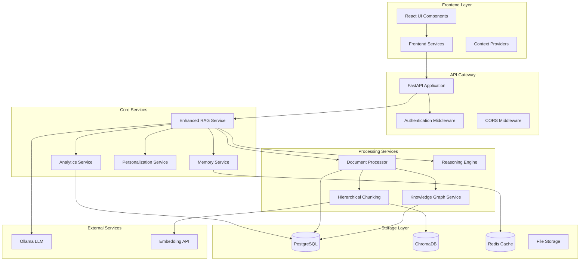

# Design Document

## Overview

This design document outlines the technical architecture for enhancing the existing RAG system with advanced features including hierarchical document chunking, knowledge graph integration, memory management, intelligent reasoning, personalization, analytics, and adaptive learning capabilities. The design builds upon the existing FastAPI backend and React frontend architecture while introducing new services and components to support sophisticated AI-powered knowledge management.

## Architecture

### High-Level Architecture



### Service Architecture

The enhanced system follows a microservices-inspired architecture with clear separation of concerns:

1. **Document Processing Pipeline**: Handles hierarchical chunking and knowledge extraction
2. **Memory Management Layer**: Manages conversation context and user preferences
3. **Intelligence Layer**: Provides reasoning, fact-checking, and summarization
4. **Personalization Engine**: Adapts system behavior based on user patterns
5. **Analytics Engine**: Tracks usage patterns and system performance

## Components and Interfaces

### 1. Hierarchical Document Chunking Service

**Purpose**: Intelligently chunk documents with overlap and sentence awareness

**Key Components**:
- `HierarchicalChunker`: Main chunking logic with configurable strategies
- `SentenceAwareProcessor`: Ensures sentence boundary preservation
- `OverlapManager`: Manages chunk overlap for context continuity
- `ChunkHierarchy`: Maintains parent-child relationships between chunks

**Interface**:
```python
class HierarchicalChunkingService:
    async def chunk_document(
        self, 
        document: Document, 
        strategy: ChunkingStrategy = "adaptive"
    ) -> List[DocumentChunk]
    
    async def get_chunk_hierarchy(self, chunk_id: str) -> ChunkHierarchy
    
    async def get_contextual_chunks(
        self, 
        chunk_id: str, 
        context_window: int = 2
    ) -> List[DocumentChunk]
```

### 2. Enhanced Knowledge Graph Service

**Purpose**: Build and maintain knowledge graphs from document content

**Key Components**:
- `EntityExtractor`: Identifies entities using NER and LLM assistance
- `RelationshipMapper`: Discovers relationships between entities
- `GraphBuilder`: Constructs and maintains the knowledge graph
- `GraphQueryEngine`: Enables semantic queries over the graph

**Interface**:
```python
class EnhancedKnowledgeGraphService:
    async def extract_entities(self, text: str) -> List[Entity]
    
    async def build_relationships(
        self, 
        entities: List[Entity], 
        context: str
    ) -> List[Relationship]
    
    async def query_graph(
        self, 
        query: str, 
        user_id: str
    ) -> GraphQueryResult
    
    async def get_entity_connections(
        self, 
        entity_id: str, 
        depth: int = 2
    ) -> List[Connection]
```

### 3. Memory Management Service

**Purpose**: Manage conversation memory and user context

**Key Components**:
- `ConversationMemoryManager`: Handles short-term conversation context
- `UserMemoryStore`: Manages long-term user preferences and history
- `ContextCompressor`: Summarizes long conversations
- `MemoryRetriever`: Retrieves relevant context for queries

**Interface**:
```python
class MemoryService:
    async def store_conversation_memory(
        self, 
        conversation_id: str, 
        memory_items: List[MemoryItem]
    ) -> None
    
    async def retrieve_relevant_context(
        self, 
        user_id: str, 
        query: str, 
        max_tokens: int = 2000
    ) -> ConversationContext
    
    async def compress_conversation(
        self, 
        conversation_id: str
    ) -> ConversationSummary
    
    async def update_user_preferences(
        self, 
        user_id: str, 
        preferences: UserPreferences
    ) -> None
```

### 4. Reasoning Engine

**Purpose**: Provide intelligent reasoning capabilities

**Key Components**:
- `CausalReasoningAgent`: Handles cause-and-effect reasoning
- `AnalogicalReasoningAgent`: Finds analogies and patterns
- `UncertaintyQuantifier`: Provides confidence scores
- `FactCheckingAgent`: Verifies factual claims
- `SummarizationAgent`: Creates intelligent summaries
- `ResearchAgent`: Conducts deep topic analysis

**Interface**:
```python
class ReasoningEngine:
    async def apply_causal_reasoning(
        self, 
        query: str, 
        context: str
    ) -> ReasoningResult
    
    async def find_analogies(
        self, 
        concept: str, 
        domain: str
    ) -> List[Analogy]
    
    async def quantify_uncertainty(
        self, 
        response: str, 
        sources: List[Source]
    ) -> UncertaintyScore
    
    async def fact_check(
        self, 
        claims: List[str], 
        sources: List[Source]
    ) -> List[FactCheckResult]
    
    async def research_topic(
        self, 
        topic: str, 
        depth: ResearchDepth
    ) -> ResearchReport
```

### 5. Personalization Service

**Purpose**: Adapt system behavior based on user patterns

**Key Components**:
- `UserProfileManager`: Maintains detailed user profiles
- `AdaptiveRetriever`: Adjusts retrieval based on user history
- `FeedbackProcessor`: Processes user feedback for system improvement
- `DomainAdapter`: Customizes behavior for specific domains

**Interface**:
```python
class PersonalizationService:
    async def get_user_profile(self, user_id: str) -> UserProfile
    
    async def adapt_retrieval_strategy(
        self, 
        user_id: str, 
        query: str
    ) -> RetrievalStrategy
    
    async def process_feedback(
        self, 
        user_id: str, 
        query_id: str, 
        feedback: UserFeedback
    ) -> None
    
    async def detect_domain_preference(
        self, 
        user_id: str
    ) -> List[DomainPreference]
```

### 6. Enhanced Analytics Service

**Purpose**: Provide comprehensive analytics and insights

**Key Components**:
- `QueryAnalyzer`: Analyzes query patterns and performance
- `DocumentAnalyzer`: Tracks document usage and effectiveness
- `UserBehaviorAnalyzer`: Studies user interaction patterns
- `TrendAnalyzer`: Identifies trends and patterns over time
- `VisualizationEngine`: Generates charts and visualizations

**Interface**:
```python
class EnhancedAnalyticsService:
    async def analyze_query_patterns(
        self, 
        user_id: str, 
        time_range: TimeRange
    ) -> QueryAnalysis
    
    async def generate_usage_insights(
        self, 
        user_id: str
    ) -> UsageInsights
    
    async def identify_knowledge_gaps(
        self, 
        user_id: str
    ) -> List[KnowledgeGap]
    
    async def generate_trend_report(
        self, 
        metric: str, 
        time_range: TimeRange
    ) -> TrendReport
```

## Data Models

### Enhanced Database Schema

```sql
-- Enhanced User Profile
CREATE TABLE user_profiles (
    id UUID PRIMARY KEY,
    user_id UUID REFERENCES users(id),
    preferences JSONB,
    interaction_history JSONB,
    domain_expertise JSONB,
    learning_style VARCHAR(50),
    created_at TIMESTAMP DEFAULT NOW(),
    updated_at TIMESTAMP DEFAULT NOW()
);

-- Hierarchical Document Chunks
CREATE TABLE document_chunks_enhanced (
    id UUID PRIMARY KEY,
    document_id UUID REFERENCES documents(id),
    parent_chunk_id UUID REFERENCES document_chunks_enhanced(id),
    content TEXT NOT NULL,
    chunk_level INTEGER DEFAULT 0,
    chunk_index INTEGER,
    overlap_start INTEGER,
    overlap_end INTEGER,
    sentence_boundaries INTEGER[],
    metadata JSONB,
    created_at TIMESTAMP DEFAULT NOW()
);

-- Knowledge Graph Entities
CREATE TABLE kg_entities (
    id UUID PRIMARY KEY,
    name VARCHAR(255) NOT NULL,
    type VARCHAR(100),
    description TEXT,
    importance_score FLOAT DEFAULT 0.0,
    document_id UUID REFERENCES documents(id),
    metadata JSONB,
    created_at TIMESTAMP DEFAULT NOW()
);

-- Knowledge Graph Relationships
CREATE TABLE kg_relationships (
    id UUID PRIMARY KEY,
    source_entity_id UUID REFERENCES kg_entities(id),
    target_entity_id UUID REFERENCES kg_entities(id),
    relationship_type VARCHAR(100),
    confidence_score FLOAT,
    context TEXT,
    metadata JSONB,
    created_at TIMESTAMP DEFAULT NOW()
);

-- Conversation Memory
CREATE TABLE conversation_memory (
    id UUID PRIMARY KEY,
    conversation_id UUID REFERENCES conversations(id),
    memory_type VARCHAR(50), -- 'short_term', 'long_term', 'context'
    content TEXT,
    importance_score FLOAT,
    timestamp TIMESTAMP DEFAULT NOW(),
    expires_at TIMESTAMP,
    metadata JSONB
);

-- User Feedback
CREATE TABLE user_feedback (
    id UUID PRIMARY KEY,
    user_id UUID REFERENCES users(id),
    message_id UUID REFERENCES messages(id),
    feedback_type VARCHAR(50), -- 'rating', 'correction', 'preference'
    feedback_value JSONB,
    processed BOOLEAN DEFAULT FALSE,
    created_at TIMESTAMP DEFAULT NOW()
);

-- Analytics Events
CREATE TABLE analytics_events (
    id UUID PRIMARY KEY,
    user_id UUID REFERENCES users(id),
    event_type VARCHAR(100),
    event_data JSONB,
    timestamp TIMESTAMP DEFAULT NOW(),
    session_id VARCHAR(255)
);

-- Auto-generated Tags
CREATE TABLE document_tags (
    id UUID PRIMARY KEY,
    document_id UUID REFERENCES documents(id),
    tag_name VARCHAR(100),
    tag_type VARCHAR(50), -- 'topic', 'domain', 'sentiment', 'complexity'
    confidence_score FLOAT,
    generated_by VARCHAR(50), -- 'llm', 'rule_based', 'user'
    created_at TIMESTAMP DEFAULT NOW()
);
```

### Redis Data Structures

```python
# Conversation Context Cache
conversation_context:{conversation_id} = {
    "short_term_memory": [...],
    "active_entities": [...],
    "context_summary": "...",
    "last_updated": timestamp
}

# User Session Cache
user_session:{user_id} = {
    "current_preferences": {...},
    "active_documents": [...],
    "query_history": [...],
    "personalization_weights": {...}
}

# Real-time Analytics Cache
analytics_buffer:{user_id}:{date} = {
    "query_count": int,
    "response_times": [...],
    "satisfaction_scores": [...],
    "document_usage": {...}
}
```

## Error Handling

### Graceful Degradation Strategy

1. **Memory Service Failure**: Fall back to stateless operation
2. **Knowledge Graph Unavailable**: Use traditional vector search
3. **Reasoning Engine Issues**: Provide standard RAG responses
4. **Analytics Service Down**: Continue core functionality without tracking
5. **Personalization Failure**: Use default system behavior

### Error Recovery Mechanisms

```python
class ErrorHandler:
    async def handle_service_failure(
        self, 
        service: str, 
        error: Exception, 
        fallback_strategy: str
    ) -> ServiceResponse
    
    async def log_error_for_analysis(
        self, 
        error: Exception, 
        context: Dict[str, Any]
    ) -> None
    
    async def attempt_service_recovery(
        self, 
        service: str, 
        max_retries: int = 3
    ) -> bool
```

## Testing Strategy

### Unit Testing
- Individual service components
- Data model validation
- Algorithm correctness
- Error handling scenarios

### Integration Testing
- Service-to-service communication
- Database operations
- External API interactions
- End-to-end workflows

### Performance Testing
- Response time benchmarks
- Memory usage optimization
- Concurrent user handling
- Large document processing

### User Acceptance Testing
- Personalization effectiveness
- Analytics accuracy
- Knowledge graph utility
- Overall user experience

## Security Considerations

### Data Privacy
- User conversation encryption
- Personal preference protection
- Analytics data anonymization
- GDPR compliance measures

### Access Control
- Role-based permissions for analytics
- User data isolation
- API rate limiting
- Audit logging for sensitive operations

### System Security
- Input validation and sanitization
- SQL injection prevention
- XSS protection
- Secure API endpoints

## Performance Optimization

### Caching Strategy
- Redis for conversation context
- In-memory caching for user preferences
- CDN for static analytics visualizations
- Database query result caching

### Scalability Measures
- Horizontal scaling for processing services
- Database sharding for large datasets
- Async processing for heavy operations
- Load balancing for API endpoints

### Resource Management
- Memory-efficient chunk processing
- Lazy loading for knowledge graphs
- Background processing for analytics
- Connection pooling for databases

This design provides a comprehensive foundation for implementing the advanced RAG features while maintaining system reliability, performance, and user experience.
