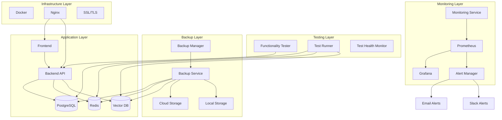

# Design Document

## Overview

This design outlines a comprehensive production monitoring, backup, and testing system for the AI Scholar Advanced RAG application. The system will provide automated functionality testing, robust backup services, real-time monitoring with alerting, and comprehensive health checks to ensure high availability and data protection.

The design leverages existing infrastructure including Docker containers, Prometheus/Grafana monitoring stack, and PostgreSQL/Redis databases while adding new components for automated testing, backup orchestration, and intelligent alerting.

## Architecture

### High-Level Architecture



### Component Architecture

#### 1. Functionality Testing System

**Components:**
- **Test Runner Service**: Orchestrates all functionality tests
- **API Test Suite**: Tests all backend endpoints
- **Database Test Suite**: Validates database operations
- **Integration Test Suite**: Tests service interactions
- **UI Test Suite**: Validates frontend functionality
- **Performance Test Suite**: Monitors response times and throughput

**Technology Stack:**
- Python with pytest for backend testing
- Playwright for frontend testing
- Custom health check endpoints
- Docker containers for isolated testing

#### 2. Automated Backup System

**Components:**
- **Backup Orchestrator**: Manages backup schedules and coordination
- **Database Backup Service**: Handles PostgreSQL backups
- **File Backup Service**: Backs up uploaded files and configurations
- **Vector DB Backup Service**: Backs up ChromaDB collections
- **Cloud Sync Service**: Synchronizes backups to cloud storage
- **Backup Verification Service**: Validates backup integrity

**Technology Stack:**
- Python with asyncio for async operations
- pg_dump for PostgreSQL backups
- AWS S3 SDK for cloud storage
- Encryption using AES-256
- Compression using gzip

#### 3. Monitoring and Alerting System

**Components:**
- **Metrics Collector**: Gathers system and application metrics
- **Alert Engine**: Processes metrics and triggers alerts
- **Dashboard Service**: Provides real-time monitoring dashboards
- **Notification Service**: Sends alerts via multiple channels
- **Health Check Service**: Continuous service health monitoring

**Technology Stack:**
- Prometheus for metrics collection
- Grafana for dashboards and visualization
- AlertManager for alert routing
- Custom Python services for application metrics
- SMTP and webhook integrations for notifications

## Components and Interfaces

### 1. Functionality Testing Components

#### Test Runner Service
```python
class TestRunner:
    async def run_comprehensive_tests() -> TestResults
    async def run_api_tests() -> APITestResults
    async def run_database_tests() -> DatabaseTestResults
    async def run_integration_tests() -> IntegrationTestResults
    async def run_performance_tests() -> PerformanceTestResults
    async def generate_test_report() -> TestReport
```

#### Health Check Endpoints
```python
# New endpoints to add to backend
@router.get("/health/comprehensive")
async def comprehensive_health_check() -> HealthStatus

@router.get("/health/database")
async def database_health_check() -> DatabaseHealth

@router.get("/health/services")
async def services_health_check() -> ServicesHealth

@router.get("/health/performance")
async def performance_health_check() -> PerformanceHealth
```

### 2. Backup System Components

#### Backup Orchestrator
```python
class BackupOrchestrator:
    async def schedule_backups() -> None
    async def run_full_backup() -> BackupResult
    async def run_incremental_backup() -> BackupResult
    async def verify_backup_integrity() -> VerificationResult
    async def cleanup_old_backups() -> CleanupResult
    async def restore_from_backup(backup_id: str) -> RestoreResult
```

#### Database Backup Service
```python
class DatabaseBackupService:
    async def backup_postgresql() -> BackupResult
    async def backup_redis() -> BackupResult
    async def backup_vector_db() -> BackupResult
    async def verify_database_backup(backup_path: str) -> bool
    async def restore_database(backup_path: str) -> RestoreResult
```

#### Cloud Storage Service
```python
class CloudStorageService:
    async def upload_backup(local_path: str, remote_path: str) -> UploadResult
    async def download_backup(remote_path: str, local_path: str) -> DownloadResult
    async def list_backups() -> List[BackupMetadata]
    async def delete_old_backups(retention_days: int) -> DeletionResult
```

### 3. Monitoring Components

#### Metrics Collector
```python
class MetricsCollector:
    async def collect_system_metrics() -> SystemMetrics
    async def collect_application_metrics() -> ApplicationMetrics
    async def collect_database_metrics() -> DatabaseMetrics
    async def collect_performance_metrics() -> PerformanceMetrics
    async def export_to_prometheus() -> None
```

#### Alert Engine
```python
class AlertEngine:
    async def evaluate_alert_rules() -> List[Alert]
    async def process_alert(alert: Alert) -> None
    async def send_notification(alert: Alert, channel: str) -> NotificationResult
    async def manage_alert_escalation() -> None
    async def suppress_duplicate_alerts() -> None
```

## Data Models

### Test Results Models
```python
@dataclass
class TestResult:
    test_name: str
    status: TestStatus
    duration: float
    error_message: Optional[str]
    timestamp: datetime

@dataclass
class TestSuite:
    suite_name: str
    tests: List[TestResult]
    total_tests: int
    passed_tests: int
    failed_tests: int
    execution_time: float

@dataclass
class ComprehensiveTestReport:
    test_suites: List[TestSuite]
    overall_status: TestStatus
    total_execution_time: float
    system_health_score: float
    recommendations: List[str]
```

### Backup Models
```python
@dataclass
class BackupMetadata:
    backup_id: str
    backup_type: BackupType
    timestamp: datetime
    size_bytes: int
    checksum: str
    encryption_key_id: str
    storage_location: str
    retention_until: datetime

@dataclass
class BackupResult:
    success: bool
    backup_id: str
    size_bytes: int
    duration: float
    error_message: Optional[str]
    metadata: BackupMetadata
```

### Monitoring Models
```python
@dataclass
class SystemMetrics:
    cpu_usage: float
    memory_usage: float
    disk_usage: float
    network_io: NetworkIO
    timestamp: datetime

@dataclass
class Alert:
    alert_id: str
    severity: AlertSeverity
    title: str
    description: str
    source: str
    timestamp: datetime
    resolved: bool
    escalation_level: int
```

## Error Handling

### Testing Error Handling
- **Test Failures**: Categorize failures by severity and provide detailed error context
- **Service Unavailability**: Implement retry mechanisms with exponential backoff
- **Timeout Handling**: Set appropriate timeouts for different test types
- **Resource Constraints**: Monitor and handle memory/CPU limitations during testing

### Backup Error Handling
- **Storage Failures**: Implement fallback storage locations
- **Network Issues**: Retry mechanisms for cloud uploads with circuit breakers
- **Corruption Detection**: Verify backup integrity and alert on corruption
- **Space Management**: Automatic cleanup when storage limits are reached

### Monitoring Error Handling
- **Metric Collection Failures**: Graceful degradation when metrics are unavailable
- **Alert Delivery Failures**: Multiple notification channels with fallbacks
- **Dashboard Unavailability**: Cached metrics and offline capabilities
- **False Positives**: Smart alert suppression and correlation

## Testing Strategy

### Unit Testing
- Individual component testing for all new services
- Mock external dependencies (databases, cloud services)
- Test coverage target: 90%+

### Integration Testing
- End-to-end testing of backup and restore processes
- Alert system testing with simulated failures
- Cross-service communication testing

### Performance Testing
- Load testing for monitoring system under high metric volume
- Backup performance testing with large datasets
- Alert system performance under high alert volume

### Disaster Recovery Testing
- Regular restore testing from backups
- Failover testing for monitoring systems
- Alert system testing during outages

## Security Considerations

### Backup Security
- **Encryption**: AES-256 encryption for all backups
- **Key Management**: Secure key storage and rotation
- **Access Control**: Role-based access to backup systems
- **Audit Logging**: Complete audit trail for backup operations

### Monitoring Security
- **Metric Privacy**: Sanitize sensitive data in metrics
- **Alert Security**: Secure alert delivery channels
- **Dashboard Access**: Authentication and authorization for dashboards
- **Data Retention**: Secure deletion of old monitoring data

### Testing Security
- **Test Data**: Use anonymized data for testing
- **Credential Management**: Secure storage of test credentials
- **Network Security**: Isolated testing environments
- **Result Privacy**: Secure storage and transmission of test results

## Performance Optimization

### Monitoring Performance
- **Metric Aggregation**: Efficient metric collection and storage
- **Query Optimization**: Optimized Prometheus queries
- **Dashboard Caching**: Cache frequently accessed dashboard data
- **Alert Batching**: Batch similar alerts to reduce noise

### Backup Performance
- **Incremental Backups**: Only backup changed data
- **Compression**: Efficient compression algorithms
- **Parallel Processing**: Concurrent backup operations
- **Network Optimization**: Optimized cloud upload strategies

### Testing Performance
- **Parallel Execution**: Run tests concurrently where possible
- **Test Optimization**: Optimize slow-running tests
- **Resource Management**: Efficient resource usage during testing
- **Caching**: Cache test setup and teardown operations

## Deployment Architecture

### Container Structure
```yaml
services:
  # Testing Services
  test-runner:
    build: ./testing
    environment:
      - TEST_DATABASE_URL
      - TEST_REDIS_URL
    volumes:
      - ./test-results:/app/results
  
  # Backup Services
  backup-orchestrator:
    build: ./backup
    environment:
      - BACKUP_SCHEDULE
      - AWS_CREDENTIALS
    volumes:
      - ./backups:/app/backups
      - postgres_data:/data/postgres:ro
  
  # Enhanced Monitoring
  monitoring-service:
    build: ./monitoring
    environment:
      - PROMETHEUS_URL
      - ALERT_WEBHOOK_URL
    ports:
      - "8080:8080"
```

### Configuration Management
- Environment-specific configuration files
- Secure credential management using Docker secrets
- Configuration validation on startup
- Hot-reloading of non-sensitive configurations

This design provides a comprehensive foundation for implementing robust production monitoring, automated backups, and thorough functionality testing while maintaining security, performance, and reliability standards.
